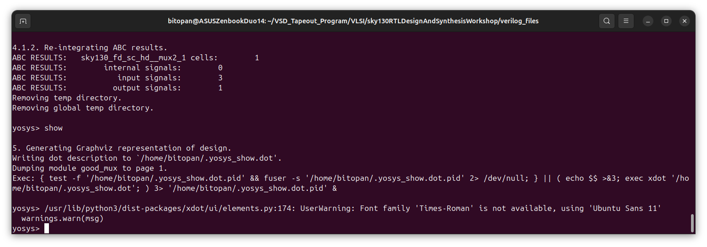
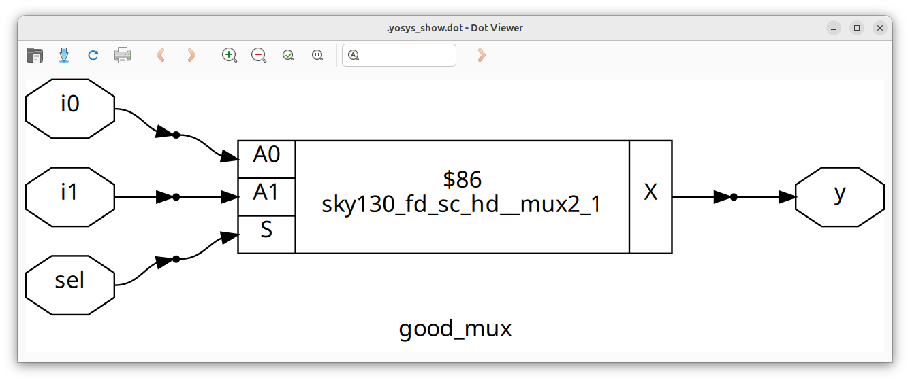

# Day 1: Introduction to Verilog RTL Design & Synthesis.
 
The focus of today is to get an introduction and understand the concepts of RTL Design, Simulation, Test-Bench, Synthesis and Netlist. Further, we will also perform two labs, simulating a 2-to-1 MUX using Iverilog and GTKWave in first lab, and then synthesizing the simulated MUX using Yosys in the second lab.

---

## 📜 Table of Contents
[1. Introduction to RTL design, Design, Simulator and Test-Bench.](#1-introduction-to-rtl-design-design-simulator-and-test-bench) <br>
[2. Lab: Simulation of a 2-to-1 MUX.](#2-lab-simulation-of-a-2-to-1-multiplexer-mux) <br>
[3. Introduction to Synthesis, Netlist, Yosys and Frontend Libraries.](#3-introduction-to-synthesis-netlist-yosys-and-frontend-libraries) <br>
[4. Lab: Synthesis of a 2-to-1 Multiplexer (MUX) using Yosys.](#4-lab-synthesis-of-a-2-to-1-multiplexer-mux-using-yosys)<br>
[5. Challenges](#%EF%B8%8F-challenges)

---

## 1. Introduction to RTL design, Design, Simulator and Test-Bench.

### 1. <ins>RTL Design</ins>
   - **What is RTL design?**
     
     RTL (Register-Transfer Level) is a way of describing digital circuits at a high level. It focuses on:

     * **Registers (storage elements):** where data is stored (flip-flops).
     * **Transfers (data movement):** how data flows between registers.
     * **Logic (combinational circuits):** how data is processed between registers.

     RTL is written in hardware description languages like Verilog or VHDL. It is the bridge between circuit design and gate-level implementation.

   - **RTL vs other levels.**

     * **Behavioral level** → describes what the system should do, not how.
     * **RTL level** → describes how data moves and is stored on clock edges.
     * **Gate level** → actual logic gates and connections.
     * **Transistor level** → physical transistor circuits.

  - **RTL Design Flow**

     1. Write RTL code in Verilog (modules).
     2. Create testbench to verify functionality.
     3. Simulate RTL (using iverilog, gtkwave).

### 2. <ins>Design (Verilog codes)</ins>
   - **What is a Verilog Design?**
     
     A design file in Verilog is the main description of your hardware module. It defines:

     * Inputs and outputs of the circuit.
     * Logic that processes inputs to produce outputs.
     * Registers and wires used inside the design.

     Verilog design files represent the hardware RTL that will eventually be synthesized into real circuits.

   - **Structure of a Verilog Module.**

     Every design starts with a `module` and ends with `endmodule`.
     <br><br>
     Template:
  
     ```
      module <module_name> (
        <port declarations>
      );
      // internal signals
      // logic (combinational + sequential)
      endmodule

     ```
     Key parts:

     * **Module name** → unique identifier for your design.
     * **Ports** → inputs and outputs of the module.
     * **Internal logic** → wires, registers, assignments, `always` blocks.

### 3. <ins>Simulator (Icarus Verilog)</ins>
   - **What is a Simulator?**
     
     A simulator is a tool that allows you to run your Verilog design in a virtual environment to check if it behaves correctly.

     * **Purpose:** Verify functionality before hardware implementation.
     * **How:** It executes the Verilog code step by step with time, showing how signals change.

     A simulator evaluates the output(s), each time one or more input(s) is/are changed.

   - **Icarus Verilog (iverilog).**

     Icarus Verilog (iverilog) is a free, open-source Verilog simulator.
     <br>
     It is widely used for:
  
     * Compiling Verilog designs and testbenches.
     * Running simulations.
     * Generating output files in `.vcd` format.
<br>
     

### 4. <ins>Testbench</ins>
   - **What is a Testbench?**
     
     A testbench is a Verilog file used to verify a design module. It is not synthesizable (cannot be implemented in hardware). Instead, it:

     * Provides stimulus (inputs) to the design.
     * Observes and checks outputs.

     Think of it as a virtual laboratory where you test your hardware before building it.
<br>
     

   - **Structure of a Testbench.**

     Unlike design modules, testbenches usually:
  
     * Have no ports (inputs/outputs).
     * Contain:
       * Register declarations for inputs.
       * Wire declarations for outputs.
       * Instantiation of the Design Under Test (DUT).
       * Stimulus (initial blocks, clocks).

---

## 2. Lab: Simulation of a 2-to-1 Multiplexer (MUX).

### 1. <ins>Objective</ins>
   To simulate a 2-to-1 Multiplexer (MUX) using Icarus Verilog (iverilog) and visualize the waveform in GTKWave.

### 2. <ins>Steps/Flow</ins>
   * Step 1: Clone GitHub Repository <br>
     Clone the repository containing the Verilog source files (design + testbench):
     ```
     git clone https://github.com/kunalg123/sky130RTLDesignAndSynthesisWorkshop.git
     cd sky130RTLDesignAndSynthesisWorkshop/verilog_files
     ```
   * Step 2: Compile the Design and Testbench <br>
     Use iverilog to compile both files into a simulation executable:
     ```
     iverilog good_mux.v tb_good_mux.v
     ```
   * Step 3: Run the Simulation <br>
     ```
     ./a.out
     ```
   * Step 4: Open Waveform in GTKWave <br>
     The testbench generates a `.vcd` file. Open it in GTKWave for visualization:
     ```
     gtkwave tb_good_mux.vcd
     ```
     <br>
     
### 3. <ins>Design Code (good_mux.v)</ins>
   ```
   module good_mux (input i0 , input i1 , input sel , output reg y);
always @ (*)
begin
	if(sel)
		y <= i1;
	else 
		y <= i0;
end
endmodule
   ```
   * Explanation:
      * Inputs: `i0`, `i1`, `sel`.
      * Output: `y`.
      * Logic:
        * If `sel` = 1 → output follows `i1`.
        * If `sel` = 0 → output follows `i0`.

### 4. <ins>Testbench Code (tb_good_mux.v)</ins>
   ```
   `timescale 1ns / 1ps
module tb_good_mux;
	// Inputs
	reg i0,i1,sel;
	// Outputs
	wire y;

	// Instantiate the Unit Under Test (UUT)
	good_mux uut (
		.sel(sel),
		.i0(i0),
		.i1(i1),
		.y(y)
	);

	initial begin
		$dumpfile("tb_good_mux.vcd");
		$dumpvars(0,tb_good_mux);

		// Initialize Inputs
		sel = 0;
		i0 = 0;
		i1 = 0;

		#300 $finish;
	end

	always #75 sel = ~sel;
	always #10 i0 = ~i0;
	always #55 i1 = ~i1;
endmodule
   ```
   * Explanation:
      * Declarations:
        * `reg i0, i1, sel;` → driven by the testbench.
        * `wire y;` → output from the DUT (Design Under Test).
      * Instantiation of DUT:
        * `good_mux uut(...)` connects the testbench signals to the MUX.
      * Dumping waveforms:
        * `$dumpfile("tb_good_mux.vcd")` → output file for GTKWave.
        * `$dumpvars(0, tb_good_mux)` → dump all signals in this module.
      * Input Initialization:
        * Start with `sel=0, i0=0, i1=0`.
        * Run simulation for 300 ns (`#300 $finish`).
      * Stimulus Generation (always blocks):
        * `always #75 sel = ~sel;` → toggle `sel` every 75 ns.
        * `always #10 i0 = ~i0;` → toggle `i0` every 10 ns.
        * `always #55 i1 = ~i1;` → toggle `i1` every 55 ns.

### 5. <ins>Expected Behavior</ins>
 * When `sel=0` → output `y` should follow `i0`.
 * When `sel=1` → output `y` should follow `i1`.
 * Waveform in GTKWave clearly shows `y` switching between `i0` and `i1` depending on `sel`.
<br>
     
 
---

## 3. Introduction to Synthesis, Netlist, Yosys and Frontend Libraries.

### 1. <ins>Introduction to Synthesis</ins>
   - **What is Synthesis?**
     
     Synthesis is the process of converting a high-level digital design description (RTL code written in Verilog/VHDL) into a gate-level netlist. This netlist uses logic gates and flip-flops from a standard cell library to implement the same functionality described in RTL.
	<br>
     In simple words, synthesis is like translating a human-readable design (RTL) into a hardware-ready recipe (netlist).

   - **Inputs & Outputs in synthesis**<br>
     	* Inputs:
			* **RTL Design** → Written in Verilog or VHDL.
			* **Constraints** → Designer’s requirements (timing, area, power).
			* **Standard Cell Libraries `(.lib)`** → Provide information about available gates, their speed, area, and power.
     	* Outputs:
			* **Netlist** → Gate-level representation of the circuit.
			* **Reports** → Timing, area, power analysis after mapping.
			* **Log files** → Messages/warnings/errors during synthesis.

  - **Position of Synthesis in the Digital Design Flow**

     1. **RTL Design** → Write design in Verilog.
     2. **RTL Simulation** → Verify design using testbenches.
     3. **Synthesis** → Convert RTL into netlist using a synthesizer.
     4. **Post-Synthesis Verification** → Simulate netlist to ensure correctness.
     5. **Physical Design** → Place and route the gates on silicon.

### 2. <ins>Synthesizer</ins>
   - **What is a Synthesizer?**
     
     A synthesizer is a software tool that converts RTL design (written in Verilog or VHDL) into a gate-level netlist using cells from a standard cell library.
	<br>
    Think of it as a translator: it reads RTL (high-level) and produces a hardware-ready design (netlist).

### 3. <ins>Netlist</ins>
   - **What is a Netlist?**
     
     A netlist is a gate-level representation of a digital circuit. It describes the design in terms of:
     * Logic gates (AND, OR, NAND, etc.) and flip-flops.
     * Connections (nets) between these gates. <br>

	 Think of it as the circuit blueprint generated after synthesis.

### 4. <ins>Yosys (Open-Source Synthesizer)</ins>
   - **What is Yosys?**
     
     Yosys (Yosys Open SYnthesis Suite) is an open-source logic synthesizer widely used in academic, research, and open-source hardware projects.

### 5. <ins>Verification of Synthesis</ins>
   - **What is Verification of Synthesis?**
     
     After synthesis, the RTL design is converted into a gate-level netlist. But we must verify that:
     * The netlist still behaves the same as the RTL.
     * No functional mismatches were introduced during synthesis. <br>

	 This step ensures the synthesizer didn’t break your design.

   - **Method of Verification**
     
     After synthesis, simulation is run on the netlist that is produced. Here, the netlist is the mapping of the initial RTL design, and therefore it consists of the same input and output ports. And hence, we use the same testbench, that we used for simulation of the RTL design, for simulating the netlist.

### 6. <ins>Front-End Libraries</ins>
   - **What is a `.lib` File?**
     
     A `.lib` (Liberty file) is a text-based library file provided by the foundry. It contains detailed characterization data for each standard cell available in a given technology.

	 Think of it as a datasheet for all the digital building blocks (gates, flip-flops, latches, etc.) in a standard cell library.

   - **Role of `.lib` in Synthesis**
     
     During synthesis, the synthesizer uses `.lib` to:
     * Understand cell behavior (logic function).
     * Check timing information (delay, setup, hold).
     * Estimate power consumption.
     * Select appropriate cells based on design constraints.

### 7. <ins>Different Flavours of the Same Gate in .lib?</ins>
   - **Introduction**
     
     In a standard cell library (`.lib`), you’ll often see multiple versions of the same logic gate, such as:
     * `AND2_X1`, `AND2_X2`, `AND2_X4`
     * `INV_X1`, `INV_X8`
	 Here, the suffix (`X1`, `X2`, `X4`, …) indicates different drive strengths or sizes of the same gate.

   - **What are Drive Strengths?**
     
     * **Drive strength** = the ability of a gate to charge/discharge load capacitance (how strong the gate is).
     * **Higher drive strength** → gate can drive larger loads (more fan-out, longer wires) but consumes more area and power.
     * **Lower drive strength** → smaller, low-power, but slower.

   - **Why Do We Need Different Variants?**
     
     * Performance Optimization
       * Critical paths may require faster (stronger) cells.
       * Non-critical paths can use smaller cells to save area/power.
     * Power Management
       * Stronger cells consume more dynamic + leakage power.
       * Smaller cells save power when speed is not critical.
     * Area Efficiency
       * Use minimum-sized cells wherever possible to reduce chip area.
       * Only use larger cells where needed.
     * Design Flexibility
       * Different design requirements (high-speed CPU vs low-power IoT chip) need different trade-offs.

### 8. <ins>Cell Selection in Synthesis (Using Constraints)</ins>
   - **Introduction**
     
     During synthesis, the tool must decide which version of each gate (fast, slow, strong, weak) to use from the standard cell library. This decision is guided by constraints provided by the designer.
	 Without constraints, the tool might generate a netlist that is functionally correct but does not meet timing, power, or area requirements.

   - **What are Constraints?**

     Constraints are rules/requirements given to the synthesizer to guide optimization. They specify how the design should behave beyond just functional correctness. The common constraints include:
     * **Timing constraints** → clock period, input/output delays.
     * **Power constraints** → maximum allowed power consumption.
     * **Area constraints** → limit on total silicon area.

   - **Balancing Trade-offs**
     
     Synthesis is always about balancing the PPA triangle:
     * Performance (timing)
     * Power
     * Area
	 Constraints tell the tool which metric to prioritize during cell selection.

---

## 4. Lab: Synthesis of a 2-to-1 Multiplexer (MUX) using Yosys.

### 1. <ins>Objective</ins>
   To synthesize the previously simulated 2-to-1 Multiplexer (MUX) using Yosys and visualize its schematic diagram.

### 2. <ins>Steps/Flow</ins>
   * Step 1: Start Yosys <br>
     ```
     yosys
     ```
   * Step 2: Read the liberty file <br>
     ```
     read_liberty -lib read_liberty -lib [address to your sky130 library file]/sky130_fd_sc_hd__tt_025C_1v80.lib

     ```
   * Step 3: Read the Verilog Code <br>
     ```
     read_verilog [address to your 2to1 MUX RTL code]/good_mux.v
     ```
   * Step 4: Synthesize the design <br>
     ```
     synth -top good_mux
     ```
   * Step 5: Technology mapping <br>
     ```
     abc -liberty [address to your sky130 library file]/sky130_fd_sc_hd__tt_025C_1v80.lib
     ```
     <br>
	 The synthesis report that will be generated will be as follows:
     
   * Step 6: Visualize the gate-level netlist <br>
     ```
     show
     ```
   * Step 7: Write the Verilog netlist file <br>
     ```
     write_verilog -noattr good_mux_netlist.v
     ```	

### 5. <ins>Expected Output</ins>
   * The visualization of the MUX will be as follows:
     <br>
   * The generated netlist file in Verilog (good_mux_netlist.v) is as follows:
   ```
   module good_mux(i0, i1, sel, y);
  input i0;
  wire i0;
  input i1;
  wire i1;
  input sel;
  wire sel;
  output y;
  wire y;
  wire _0_;
  wire _1_;
  wire _2_;
  wire _3_;
  sky130_fd_sc_hd__mux2_1 _4_ (
    .A0(_0_),
    .A1(_1_),
    .S(_2_),
    .X(_3_)
  );
  assign _0_ = i0;
  assign _1_ = i1;
  assign _2_ = sel;
  assign y = _3_;
endmodule
   ```
---

## ⚠️ Challenges

### 1. <ins>Yosys shows Command Error:</ins>
* Problem:<br>
  While synthesizing the Verilog MUX design in Yosys, the synthesis completed successfully. However, executing the `show` command to generate the schematic diagram resulted in the following error:
  ```
  ModuleNotFoundError: No module named 'distutils'
  ```
* Cause:<br>
  The `show` command in Yosys relies on Python scripts internally, which in turn require the `distutils` module. In recent Python versions (3.12+), distutils has been removed from the standard library. As a result, Yosys could not find the module, causing the error.
* Solution:<br>
  The issue was resolved by installing the `setuptools` package, which provides the necessary functionality previously handled by `distutils`. The following command was used:
  ```
  sudo apt update
  sudo apt install python3-setuptools python3-venv
  ```
  After installing `setuotools`, the `show` command in Yosys executed successfully, and the schematic diagram was generated.
