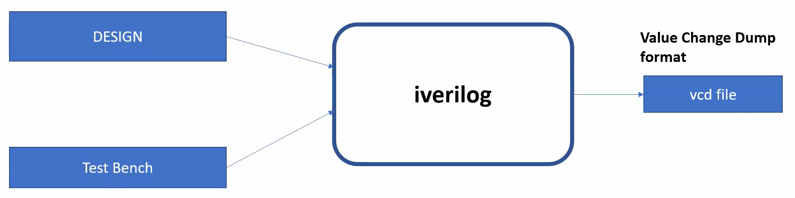
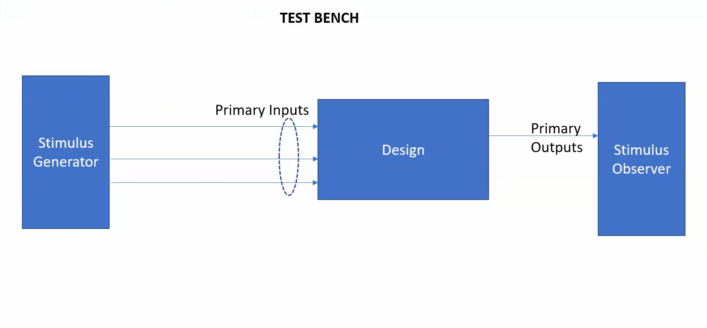
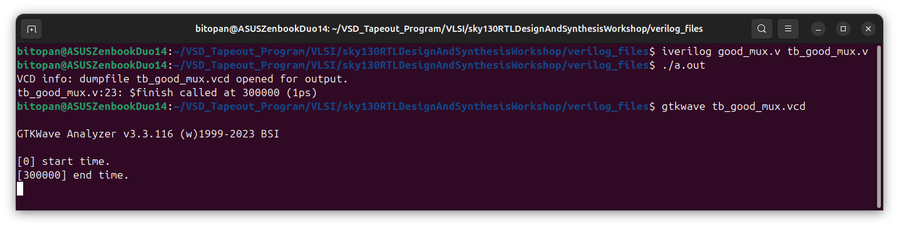
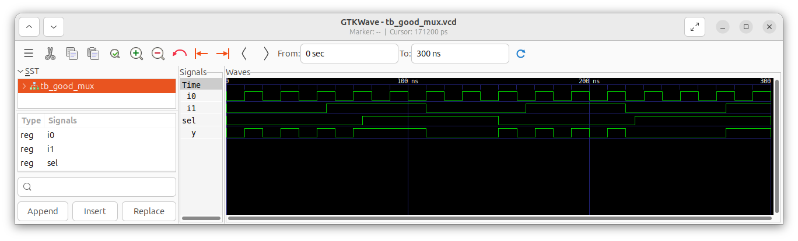

# Day 1: Introduction to Verilog RTL Design & Synthesis.
 
The focus of today is 

---

## 📜 Table of Contents
[1. Introduction to RTL design, Design, Simulator and Test-Bench.](#1-introduction-to-rtl-design-design-simulator-and-test-bench) <br>
[2. Lab: Simulation of a 2-to-1 MUX.](2-lab-simulation-of-a-2-to-1-mux)

---

## 1. Introduction to RTL design, Design, Simulator and Test-Bench.

### 1. <ins>RTL Design</ins>
   - **What is RTL design?**
     
     RTL (Register-Transfer Level) is a way of describing digital circuits at a high level. It focuses on:

     * **Registers (storage elements):** where data is stored (flip-flops).
     * **Transfers (data movement):** how data flows between registers.
     * **Logic (combinational circuits):** how data is processed between registers.

     RTL is written in hardware description languages like Verilog or VHDL. It is the bridge between circuit design and gate-level implementation.

   - **RTL vs other levels.**

     * **Behavioral level** → describes what the system should do, not how.
     * **RTL level** → describes how data moves and is stored on clock edges.
     * **Gate level** → actual logic gates and connections.
     * **Transistor level** → physical transistor circuits.

  - **RTL Design Flow**

     1. Write RTL code in Verilog (modules).
     2. Create testbench to verify functionality.
     3. Simulate RTL (using iverilog, gtkwave).

### 2. <ins>Design (Verilog codes)</ins>
   - **What is a Verilog Design?**
     
     A design file in Verilog is the main description of your hardware module. It defines:

     * Inputs and outputs of the circuit.
     * Logic that processes inputs to produce outputs.
     * Registers and wires used inside the design.

     Verilog design files represent the hardware RTL that will eventually be synthesized into real circuits.

   - **Structure of a Verilog Module.**

     Every design starts with a `module` and ends with `endmodule`.
     <br><br>
     Template:
  
     ```
      module <module_name> (
        <port declarations>
      );
      // internal signals
      // logic (combinational + sequential)
      endmodule

     ```
     Key parts:

     * **Module name** → unique identifier for your design.
     * **Ports** → inputs and outputs of the module.
     * **Internal logic** → wires, registers, assignments, `always` blocks.

### 3. <ins>Simulator (Icarus Verilog)</ins>
   - **What is a Simulator?**
     
     A simulator is a tool that allows you to run your Verilog design in a virtual environment to check if it behaves correctly.

     * **Purpose:** Verify functionality before hardware implementation.
     * **How:** It executes the Verilog code step by step with time, showing how signals change.

     A simulator evaluates the output(s), each time one or more input(s) is/are changed.

   - **Icarus Verilog (iverilog).**

     Icarus Verilog (iverilog) is a free, open-source Verilog simulator.
     <br>
     It is widely used for:
  
     * Compiling Verilog designs and testbenches.
     * Running simulations.
     * Generating output files in `.vcd` format.
<br>
     

### 4. <ins>Testbench</ins>
   - **What is a Testbench?**
     
     A testbench is a Verilog file used to verify a design module. It is not synthesizable (cannot be implemented in hardware). Instead, it:

     * Provides stimulus (inputs) to the design.
     * Observes and checks outputs.

     Think of it as a virtual laboratory where you test your hardware before building it.
<br>
     

   - **Structure of a Testbench.**

     Unlike design modules, testbenches usually:
  
     * Have no ports (inputs/outputs).
     * Contain:
       * Register declarations for inputs.
       * Wire declarations for outputs.
       * Instantiation of the Design Under Test (DUT).
       * Stimulus (initial blocks, clocks).

---

## 2. Lab: Simulation of a 2-to-1 Multiplexer (MUX).

### 1. <ins>Objective</ins>
   To simulate a 2-to-1 Multiplexer (MUX) using Icarus Verilog (iverilog) and visualize the waveform in GTKWave.

### 2. <ins>Steps/Flow</ins>
   * Step 1: Clone GitHub Repository <br>
     Clone the repository containing the Verilog source files (design + testbench):
     ```
     git clone https://github.com/kunalg123/sky130RTLDesignAndSynthesisWorkshop.git
     cd sky130RTLDesignAndSynthesisWorkshop/verilog_files
     ```
   * Step 2: Compile the Design and Testbench <br>
     Use iverilog to compile both files into a simulation executable:
     ```
     iverilog good_mux.v tb_good_mux.v
     ```
   * Step 3: Run the Simulation <br>
     ```
     ./a.out
     ```
   * Step 4: Open Waveform in GTKWave <br>
     The testbench generates a `.vcd` file. Open it in GTKWave for visualization:
     ```
     gtkwave tb_good_mux.vcd
     ```
     <br>
     
### 3. <ins>Design Code (good_mux.v)</ins>
   ```
   module good_mux (input i0 , input i1 , input sel , output reg y);
always @ (*)
begin
	if(sel)
		y <= i1;
	else 
		y <= i0;
end
endmodule

   ```
   * Explanation:
      * Inputs: `i0`, `i1`, `sel`.
      * Output: `y`.
      * Logic:
        * If `sel` = 1 → output follows `i1`.
        * If `sel` = 0 → output follows `i0`.

### 4. <ins>Testbench Code (tb_good_mux.v)</ins>
   ```
   `timescale 1ns / 1ps
module tb_good_mux;
	// Inputs
	reg i0,i1,sel;
	// Outputs
	wire y;

	// Instantiate the Unit Under Test (UUT)
	good_mux uut (
		.sel(sel),
		.i0(i0),
		.i1(i1),
		.y(y)
	);

	initial begin
		$dumpfile("tb_good_mux.vcd");
		$dumpvars(0,tb_good_mux);

		// Initialize Inputs
		sel = 0;
		i0 = 0;
		i1 = 0;

		#300 $finish;
	end

	always #75 sel = ~sel;
	always #10 i0 = ~i0;
	always #55 i1 = ~i1;
endmodule


   ```
   * Explanation:
      * Declarations:
        * `reg i0, i1, sel;` → driven by the testbench.
        * `wire y;` → output from the DUT (Design Under Test).
      * Instantiation of DUT:
        * `good_mux uut(...)` connects the testbench signals to the MUX.
      * Dumping waveforms:
        * `$dumpfile("tb_good_mux.vcd")` → output file for GTKWave.
        * `$dumpvars(0, tb_good_mux)` → dump all signals in this module.
      * Input Initialization:
        * Start with `sel=0, i0=0, i1=0`.
        * Run simulation for 300 ns (`#300 $finish`).
      * Stimulus Generation (always blocks):
        * `always #75 sel = ~sel;` → toggle `sel` every 75 ns.
        * `always #10 i0 = ~i0;` → toggle `i0` every 10 ns.
        * `always #55 i1 = ~i1;` → toggle `i1` every 55 ns.

### 5. <ins>Expected Behavior</ins>
 * When `sel=0` → output `y` should follow `i0`.
 * When `sel=1` → output `y` should follow `i1`.
 * Waveform in GTKWave clearly shows `y` switching between `i0` and `i1` depending on `sel`.
<br>
     
 
