# Day 2: Timing Libraries, Hierarchical vs Flat Synthesis, and Efficient Flip-Flop coding styles.
 
In Day 2, the focus will be on understanding timing libraries, exploring hierarchical vs. flattened synthesis, studying different flip-flop coding styles, and at last, analyzing two special-case optimizations in digital circuits.

---

## 📜 Table of Contents
[1. Timing Libraries](#1-timing-libraries) <br>
[2. Hierarchical vs Flattened Synthesis](#2-hierarchical-vs-flattened-synthesis) <br>
[3. Different Flip-Flop Coding Styles](#3-different-flip-flop-coding-styles)<br>
[4. Some Special-Case Optimizations in Digital Circuits](#4-some-special-case-optimizations-in-digital-circuits)<br>

---

## 1. Timing Libraries.

### 1. <ins>Variations in Semiconductor Devices</ins>
   - **The behavior of semiconductor devices is not constant—it varies due to three main factors:**

     * **Process variations:** Differences introduced during fabrication.
     * **Voltage variations:** Fluctuations in the supply voltage.
     * **Temperature variations:** Operating conditions changing device characteristics.

     These variations are collectively referred to as PVT (Process, Voltage, Temperature) variations, and they directly impact the timing, power, and reliability of circuits.

### 2. <ins>PDK (Process Design Kit)</ins>

  A Process Design Kit is a collection of files and models provided by the semiconductor foundry. It includes all the essential information for designing and simulating circuits using that particular technology node. For example, the SKY130 PDK is an open-source PDK provided by SkyWater for the 130 nm technology node, widely used in research and learning environments.

### 3. <ins>PDK Nomenclature Example</ins>
     
  A common naming convention in PDKs specifies process, voltage, and temperature corners. <br>Example: tt_025C_1v80
  
  * **tt** → Typical process corner
  * **025C** → 25 °C operating temperature
  * **1v80** → 1.80 V supply voltage

Such nomenclature helps identify the exact operating condition under which the timing and power data are valid.

### 4. <ins>Cell Characterization in Timing Libraries</ins>
     
  Timing libraries define the behavior of standard cells under different input conditions. For each input combination of a cell, the library specifies:

   * The power consumed at that pin.
   *  The timing information (delays, transition times, etc.).

  This allows EDA tools to analyze how the cell performs in real circuits.

### 5. <ins>Variants of Standard Cells</ins>
     
  Standard cells often come in multiple variants of the same function (e.g., multiple inverters of different drive strengths).<br>The timing library specifies for each variant:

  * Power consumption
  * Area occupied

This helps designers choose the most suitable variant based on design trade-offs between speed, power, and area.

---

## 2. Hierarchical vs Flattened Synthesis.

### 1. <ins>Gate-Level Preference in Synthesis</ins>

  In CMOS design, logic functions can often be implemented using either NAND or NOR gates. Due to transistor characteristics, stacked PMOS transistors perform worse (slower, higher resistance) than stacked NMOS transistors. As a result, synthesizers generally prefer NAND gates over NOR gates, since NAND-based implementations tend to be faster and more power-efficient.

### 2. <ins>Hierarchy in Digital Design</ins>
   - **Instantiation**
     
     Instantiation refers to the process of creating an instance, or a copy, of a module within another module. This is a fundamental concept for building hierarchical designs, where complex hardware systems are broken down into smaller, more manageable sub-modules.<br>
     Essentially, you define a module once (like a blueprint for a specific hardware component), and then you can "instantiate" it multiple times within a higher-level module, each time creating a distinct, independent copy of that component.<br>
     Example: an ALU module may instantiate multiple adder or multiplier submodules. This allows modular design, reusability, and scalability.

   - **Hierarchy in Digital Design**
     
     A hierarchical design is one in which the system is described in terms of modules and submodules. Each submodule encapsulates a smaller piece of functionality, and the overall design is built by instantiating and connecting these modules.<br>
     When hierarchy is preserved, the structure of modules and submodules is retained during synthesis, instead of being merged into a single-level netlist.

### 3. <ins>Hierarchical Synthesis</ins>
In hierarchical synthesis, the design is synthesized while keeping the module boundaries intact.

   - **Advantages**

     * Easier debugging and verification since the structure of the design is visible.
     * Promotes reusability—a submodule can be instantiated multiple times without redefining it.
     * Enables divide-and-conquer synthesis of large designs, where submodules are synthesized independently and then stitched together.
   - **Disadvantages**

     * May not achieve the best possible optimization, since the synthesizer is restricted by the module boundaries.
     * Slightly larger area or longer delay compared to a fully optimized flat design.

   - **Schematic diagram of Hierarchical design:**   
     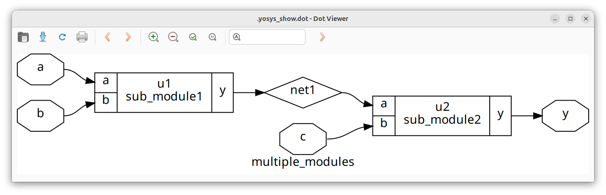

### 4. <ins>Flattened Synthesis</ins>
In flattened synthesis, the hierarchy is removed and the entire design is synthesized as one flat module.

   - **Advantages**

     * Allows the synthesizer maximum flexibility for optimization across module boundaries.
     * Can result in smaller area, lower power consumption, and better performance.
   - **Disadvantages**

     * Debugging becomes more difficult, as the original module structure is lost.
     * Netlists can become very large and complex, making them harder to understand and manage.
     * Reusability of submodules is lost.

   - **Schematic diagram of Flattened design:**   
     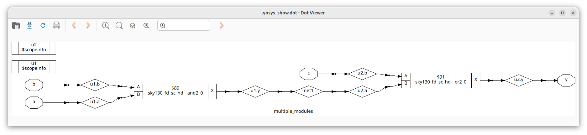
     
### 5. <ins>Submodule-Level Synthesis</ins>
Sometimes, submodules are synthesized independently before integrating into the full design.

   - **Reasons**

     * If a submodule is instantiated multiple times, synthesizing it once and reusing the result saves effort.
     * For large designs, synthesizing submodules separately allows better handling of complexity and enables a divide-and-conquer approach to synthesis.

   - **Schematic diagram of Sub-module instantiation:**   
     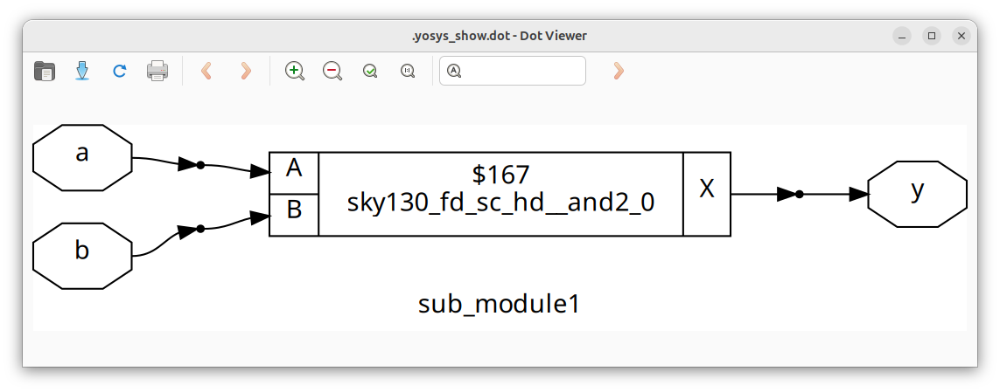

---

## 3. Different Flip-Flop Coding Styles.

### 1. <ins>Glitches in Combinational Circuits</ins>

  In purely combinational circuits, the output is determined directly by the inputs. Due to unequal signal propagation delays, the final output may momentarily show incorrect values, called glitches. <br>
  If multiple combinational circuits are connected in series, these glitches can multiply and spread further, creating instability.

### 2. <ins>Role of Flip-Flops in Controlling Glitches</ins>

  To prevent glitches from propagating, flip-flops are inserted between combinational blocks. A flip-flop samples its input only on a clock edge and holds the value stable until the next edge. <br>
  This ensures that even if glitches occur inside a combinational circuit, only the correct, clock-aligned value is passed to the next stage.

### 3 <ins>Types of Flip-Flops and Coding Styles</ins>

Flip-flops can be described in Verilog in different coding styles depending on whether the reset or set behavior is asynchronous (immediate) or synchronous (clock-controlled).
   - **Asynchronous Reset Flip-Flop**

     * **Behavior**: The output is reset to 0 immediately when the reset signal is asserted, regardless of the clock.
     * **Use Case**: Used when a circuit must be reset instantly on power-up or during fault conditions.
     * An Asynchronous Reset D Flip-Flop is given below:
       ```
       module dff_asyncres (input clk, input async_reset, input d, output reg q);
       always @ (posedge clk, posedge async_reset)
       if (async_reset)
         q <= 1'b0;
       else
         q <= d;
       endmodule
       ```
     * The above code produces the following response in GTKWave:
       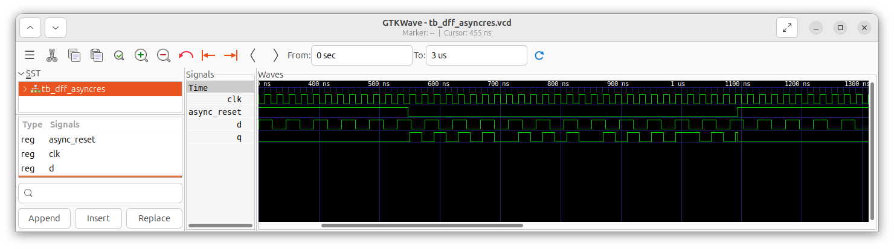
     * The schematic when synthesized in Yosys:
       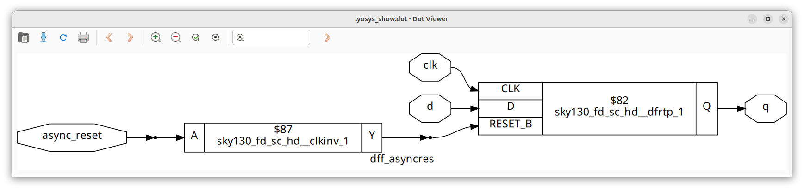

   - **Asynchronous Set Flip-Flop**

     * **Behavior**: The output is set to 1 immediately when the set signal is asserted, independent of the clock.
     * **Use Case**: Useful for initializing circuits that need to start in a known high state.
     * An Asynchronous Set D Flip-Flop is given below:
       ```
       module dff_async_set (input clk, input async_set, input d, output reg q);
       always @ (posedge clk, posedge async_set)
         if (async_set)
           q <= 1'b1;
         else
           q <= d;
       endmodule
       ```
     * The above code produces the following response in GTKWave:
       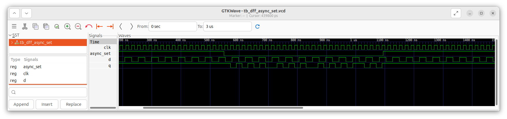
     * The schematic when synthesized in Yosys:
       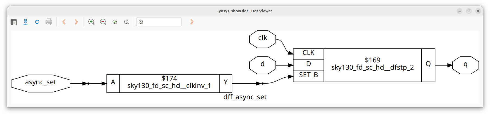

   - **Synchronous Reset Flip-Flop**

     * **Behavior**: The output is reset to 0, but only on the next active clock edge when the reset signal is asserted.
     * **Use Case**: Common in synchronous designs where reset must align with the clock, ensuring predictable timing.
     * An Synchronous Reset D Flip-Flop is given below:
       ```
       module dff_syncres (input clk, input async_reset, input sync_reset, input d, output reg q);
       always @ (posedge clk)
         if (sync_reset)
           q <= 1'b0;
         else
           q <= d;
       endmodule
       ```
     * The above code produces the following response in GTKWave:
       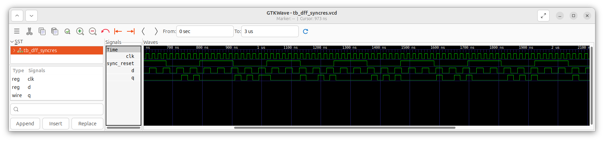
     * The schematic when synthesized in Yosys:
       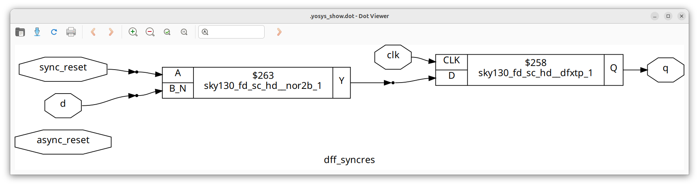

   - **Synchronous Set Flip-Flop**

     * **Behavior**: The output is set to 1 on the next clock edge when the set signal is asserted.
     * **Use Case**: Useful in designs that require controlled initialization at a clock boundary.

---

## 4. Some Special-Case Optimizations in Digital Circuits.

### 1. <ins>Binary Multiplication by Powers of 2</ins>
   - **In binary arithmetic, multiplication by `2` is equivalent to a left shift operation with the least significant bit (LSB) filled by `0`.**

     * Example: `101 (5)` × 2 = `1010 (10)`.
     * More generally, multiplication by 2ⁿ corresponds to a left shift by `n` positions.

     To realize these circuits, no dedicated hardware (like multipliers) is required. The operation can be implemented purely by rewiring inputs to outputs with the appropriate shift. This results in efficient implementation with minimal area and power usage.

### 2. <ins>Multiplication by Composite Numbers</ins>
   - **Multiplication by certain constants can be expressed as combinations of shifts and additions.**

     * For example, consider multiplying a 3-bit number `a` by `9`:
       * `a × 9 = a × (8 + 1)`
       * `a × 8` is achieved by left-shifting `a` by 3 positions.
       * Adding the shifted version back to `a` gives the final result.

     Similar to the previous case, this requires no explicit multiplier hardware. The operation is implemented by rewiring and simple addition, optimizing hardware usage.

### 3. <ins>Intelligent Optimizations in Synthesis Tools</ins>

  Modern synthesis tools (like Yosys) automatically detect such special cases during optimization. Instead of generating large multiplier circuits, the tool simplifies the design into shift-and-add structures. This leads to efficient schematics that are functionally equivalent but require significantly fewer resources, as can be seen below:
  * Binary Multiplication by 2, synthesized by Yosys:
    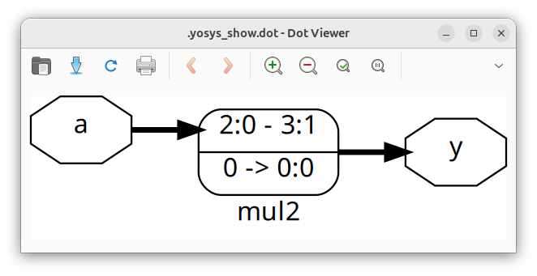
  * Binary Multiplication by 9, synthesized by Yosys:
    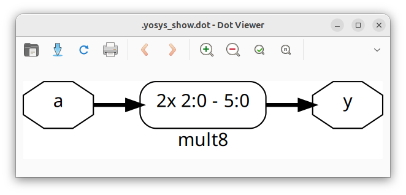    
