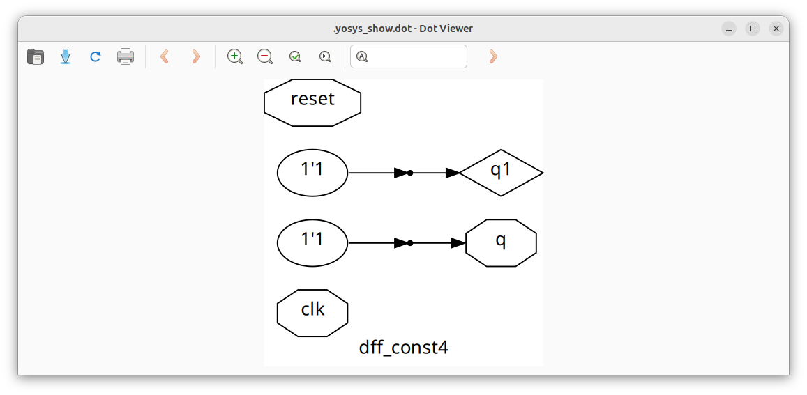

# Day 3: Combinational and Sequential Logic Optimizations
 
The focus of today is 

---

## 📜 Table of Contents
[1. Introduction to Logic Optimizations](#1-introduction-to-logic-optimizations) <br>
[2. Combinational Logic Optimization](#2-combinational-logic-optimization) <br>
[3. Sequential Logic Optimization](#3-sequential-logic-optimization) <br>
[4. Labs: Combinational Logic Optimization](#4-labs-combinational-logic-optimization) <br>
[5. Labs: Sequential Logic Optimization](#5-labs-sequential-logic-optimization) <br>
[6. Unused Output Optimization](#6-unused-output-optimization) <br>

---

## 1. Introduction to Logic Optimizations.

Logic optimization is the process of transforming a digital circuit to achieve a more efficient design. The goal is to minimize area, reduce power consumption, and improve performance, while still preserving the original functionality. Optimization can be broadly divided into combinational logic optimization and sequential logic optimization.

---

## 2. Combinational Logic Optimization.

Combinational optimization focuses on simplifying circuits where the output depends only on the present inputs.

### 1. <ins>Constant Propagation</ins>
   - **Definition:** A technique where constant values (0 or 1) are propagated through the logic network to simplify expressions.
   - **How it is done:** If an input is tied to a constant, redundant logic is removed. For example, `A & 0 = 0`, `A | 1 = 1`.
   - **Where to use:** Useful when portions of the logic are fixed, such as configuration signals or unused features.

### 2. <ins>Boolean Logic Optimization</ins>
   - **Definition:** Minimization of Boolean functions to reduce the number of literals, gates, or levels of logic.
   - **How it is done:**

     * **Karnaugh Maps (K-Maps)**: Visual simplification for functions with up to 4–6 variables.
     * **Quine–McCluskey Algorithm**: Tabular method suitable for larger functions, providing exact minimization.
   - **Where to use:**

     * **K-Maps**: Small-scale circuits and educational contexts.
     * **Quine–McCluskey**: Automated tools and larger-scale optimizations, though computationally expensive.

---

## 3. Sequential Logic Optimization.

Sequential optimization applies to circuits where the output depends on both current inputs and stored states.

### 1. <ins>Sequential Constant Propagation</ins>
   - **Definition:** Similar to combinational constant propagation but extended to sequential circuits. If a flip-flop always receives a constant input, its output is constant after initialization.
   - **How it is done:** Identify registers or states that never change and replace them with constants.
   - **Where to use:** Reduces unnecessary flip-flops and logic, saving both area and power.

### 2. <ins>State Optimization</ins>
   - **Definition:** Minimizing the number of states in a finite state machine (FSM) without altering functionality.
   - **How it is done:** Merge equivalent or unreachable states.
   - **Where to use:** In FSM-heavy designs to reduce flip-flop count and simplify transition logic.

### 3. <ins>Retiming</ins>
   - **Definition:** Moving registers across combinational logic while preserving functionality.
   - **How it is done:** Flip-flops are shifted forward or backward in the design to balance path delays.
   - **Where to use:** To improve performance (timing closure) and reduce critical path delays.

### 4. <ins>Sequential Logic Cloning (Floorplan-Aware Synthesis)</ins>
   - **Definition:** Duplicating sequential elements (flip-flops) in different regions of the chip to shorten interconnect delays.
   - **How it is done:** The synthesis tool creates multiple instances of a register closer to the logic they drive.
   - **Where to use:** In physical design, when a single flip-flop drives multiple distant loads, leading to long wires and high delay.

---

## 4. Labs: Combinational Logic Optimization.

**Important:** Use the command `opt_clean -purge` between `synth -top` and `abc -liberty` to optimise the Verilog designs.

### 1. <ins>Lab 1</ins>
   - **Verilog code:**
     ```
     module opt_check (input a , input b , output y);
       assign y = a?b:0;
     endmodule
     ```
   - **Explanation:**
     `assign y = a ? b : 0;` means:
       * If `a` is true, `y` is assigned the value of `b`.
       * If `a` is false, `y` is assigned `0`.
   - **Optimized synthesis:**
     
     
### 2. <ins>Lab 2</ins>
   - **Verilog code:**
     ```
     module opt_check2 (input a , input b , output y);
	     assign y = a?1:b;
     endmodule
     ```
   - **Explanation:**
     `assign y = a ? 1 : b;` means:
       * If `a` is true, `y` is assigned `1`.
       * If `a` is false, `y` is assigned the value of `b`.
   - **Optimized synthesis:**
     

### 3. <ins>Lab 3</ins>
   - **Verilog code:**
     ```
     module opt_check3 (input a , input b, input c , output y);
	     assign y = a?(c?b:0):0;
     endmodule
     ```
   - **Explanation:**
     `assign y = a ? (c ? b : 0) : 0;` means:
       * If `a` is true, then:
         * If `c` is true, `y` is assigned the value of `b`.
         * If `c` is false, `y` is `0`.
       * If `a` is false, `y` is `0`.
   - **Optimized synthesis:**
     

### 4. <ins>Lab 4</ins>
   - **Verilog code:**
     ```
     module opt_check4 (input a , input b , input c , output y);
       assign y = a?(b?(a & c ):c):(!c);
     endmodule
     ```
   - **Explanation:**
     `assign y = a ? (b ? (a & c) : c) : (!c);` means:
       * If `a` is true, then:
         * If `b` is true, `y = a & c`.
         * If `b` is false, `y = c`.
       * If `a` is false, `y = !c`.
   - **Optimized synthesis:**
     

### 5. <ins>Lab 5</ins>
   - **Verilog code:**
     ```
     module sub_module1(input a , input b , output y);
       assign y = a & b;
     endmodule


     module sub_module2(input a , input b , output y);
      assign y = a^b;
     endmodule


     module multiple_module_opt(input a , input b , input c , input d , output y);
     wire n1,n2,n3;

     sub_module1 U1 (.a(a) , .b(1'b1) , .y(n1));
     sub_module2 U2 (.a(n1), .b(1'b0) , .y(n2));
     sub_module2 U3 (.a(b), .b(d) , .y(n3));

     assign y = c | (b & n1);
     
     endmodule
     ```
   - **Explanation:**
       * `sub_module1` → outputs `y = a & b`.
       * `sub_module2` → outputs `y = a ^ b`.
       * Inside `multiple_module_opt`:
         * `U1: n1 = a & 1` → simplifies to `n1 = a`.
         * `U2: n2 = n1 ^ 0` → simplifies to `n2 = n1 = a`.
         * `U3: n3 = b ^ d`.
         * Final: `y = c | (b & n1)` → becomes `y = c | (b & a)`.
   - **Hierarchical synthesis:**
     
   - **Flattened synthesis:**
     
   - **Optimized synthesis:**
     

### 6. <ins>Lab 6</ins>
   - **Verilog code:**
     ```
     module sub_module(input a , input b , output y);
      assign y = a & b;
     endmodule

     module multiple_module_opt2(input a , input b , input c , input d , output y);
     wire n1,n2,n3;

     sub_module U1 (.a(a) , .b(1'b0) , .y(n1));
     sub_module U2 (.a(b), .b(c) , .y(n2));
     sub_module U3 (.a(n2), .b(d) , .y(n3));
     sub_module U4 (.a(n3), .b(n1) , .y(y));

     endmodule
     ```
   - **Explanation:**
       * `sub_module`: outputs `y = a & b`.
       * Inside `multiple_module_opt2`:
         * `U1`: `n1 = a & 0` → `n1 = 0`.
         * `U2`: `n2 = b & c`.
         * `U3`: `n3 = n2 & d = (b & c & d)`.
         * `U4`: `y = n3 & n1 = (b & c & d) & 0`.
   - **Hierarchical synthesis:**
     
   - **Flattened synthesis:**
     
   - **Optimized synthesis:**
     

---

## 5. Labs: Sequential Logic Optimization.

**Important:** Use the following command between `synth -top` and `abc -liberty` while synthesizing Flip-Flops in Yosys.
  ```
  read_liberty -lib read_liberty -lib [address to your sky130 library file]/sky130_fd_sc_hd__tt_025C_1v80.lib
  ```

### 1. <ins>Lab 1</ins>
   - **Verilog code:**
     ```
     module dff_const1(input clk, input reset, output reg q);
     always @(posedge clk, posedge reset)
     begin
     	if(reset)
	     	q <= 1'b0;
     	else
     		q <= 1'b1;
     end

     endmodule
     ```
   - **Explanation:**
     On the rising edge of `clk` or `reset`:
       * If `reset` is true, `q` is set to `0`.
       * Otherwise, `q` is set to `1`.
   - **Response in GTKWave:**
     
   - **Optimized synthesis:**
     
     
### 2. <ins>Lab 2</ins>
   - **Verilog code:**
     ```
     module dff_const2(input clk, input reset, output reg q);
     always @(posedge clk, posedge reset)
     begin
     	if(reset)
     		q <= 1'b1;
     	else
     		q <= 1'b1;
     end

     endmodule
     ```
   - **Explanation:**
     On the rising edge of `clk` or `reset`:
       * Regardless of `reset`, `q` is always set to `1`.
   - **Response in GTKWave:**
     
   - **Optimized synthesis:**
     

### 3. <ins>Lab 3</ins>
   - **Verilog code:**
     ```
     module dff_const3(input clk, input reset, output reg q);
     reg q1;

     always @(posedge clk, posedge reset)
     begin
     	if(reset)
     	begin
     		q <= 1'b1;
     		q1 <= 1'b0;
     	end
     	else
     	begin
     		q1 <= 1'b1;
     		q <= q1;
     	end
     end

     endmodule
     ```
   - **Explanation:**
     On the rising edge of `clk` or `reset`:
       * If `reset` is true:
         * `q` is set to `1`.
         * `q1` is set to `0`.
       * Otherwise:
         * `q1` is set to `1`.
         * `q` takes the previous value of `q1`.
   - **Response in GTKWave:**
     
   - **Optimized synthesis:**
     

### 4. <ins>Lab 4</ins>
   - **Verilog code:**
     ```
     module dff_const4(input clk, input reset, output reg q);
     reg q1;

     always @(posedge clk, posedge reset)
     begin
     	if(reset)
     	begin
	     	q <= 1'b1;
	     	q1 <= 1'b1;
     	end
     	else
     	begin
	     	q1 <= 1'b1;
	     	q <= q1;
	     end
     end
 
     endmodule
     ```
   - **Explanation:**
     On the rising edge of `clk` or `reset`:
       * If `reset` is true:
         * `q = 1` and `q1 = 1`.
       * Otherwise:
         * `q1 = 1`.
         * `q` takes the previous value of `q1`, which is always `1`.
   - **Response in GTKWave:**
     
   - **Optimized synthesis:**
     

### 4. <ins>Lab 4</ins>
   - **Verilog code:**
     ```
     module dff_const5(input clk, input reset, output reg q);
     reg q1;

     always @(posedge clk, posedge reset)
     begin
     	if(reset)
     	begin
     		q <= 1'b0;
     		q1 <= 1'b0;
     	end
     	else
     	begin
     		q1 <= 1'b1;
     		q <= q1;
     	end
     end

     endmodule
     ```
   - **Explanation:**
     On the rising edge of `clk` or `reset`:
       * If `reset` is true:
         * `q = 0` and `q1 = 0`.
       * Otherwise:
         * `q1 = 1`.
         * `q` takes the previous value of `q1`.
   - **Response in GTKWave:**
     
   - **Optimized synthesis:**
     

---

## 6. Unused Output Optimization.

### 1. <ins>Definition</ins>
Unused output optimization is the process where synthesis tools remove logic (gates, flip-flops, wires) that produce signals not used anywhere in the circuit.

### 2. <ins>Why it is done?</ins>
   - To reduce area (fewer gates and flip-flops).
   - To reduce power consumption (unused signals don’t toggle).
   - To improve performance (simpler circuit, shorter paths).

### 3. <ins>When it is done?</ins> 
   - When outputs of some logic are never used in further computations.
   - When some signals are not connected to module outputs.
   - During synthesis, the tool automatically detects and eliminates them.

### 4. <ins>Example</ins> 
   - Suppose we design a 3-bit up counter using D flip-flops. But we only need the 1’s place bit (LSB) as the final output. The synthesis tool observes that the other two bits (bit1 and bit2) are not used anywhere.
   - Result → Those flip-flops and related logic are completely removed, leaving only the LSB flip-flop.
   - The Verilog Code of the above example:
     ```
     module counter_opt (input clk , input reset , output q);
     reg [2:0] count;
     assign q = count[0];

     always @(posedge clk ,posedge reset)
     begin
     	if(reset)
     		count <= 3'b000;
     	else
     		count <= count + 1;
     end

     endmodule
     ```
   - Response in GTKWave:
     
   - **Optimized synthesis:**
     
