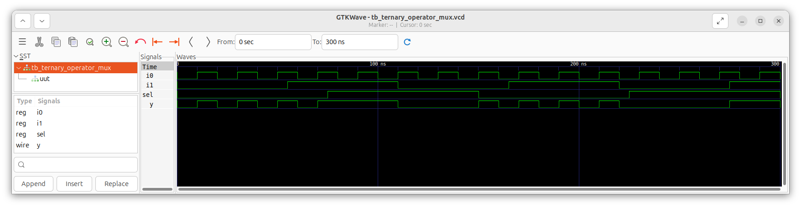
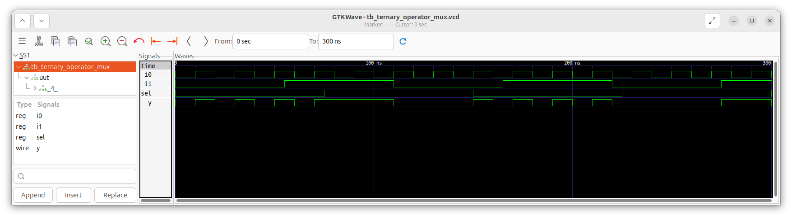
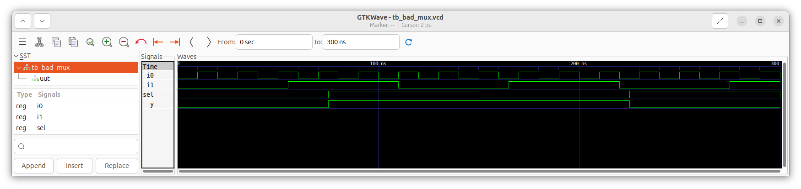
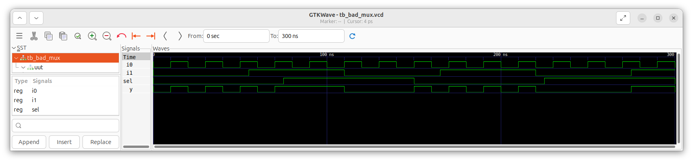
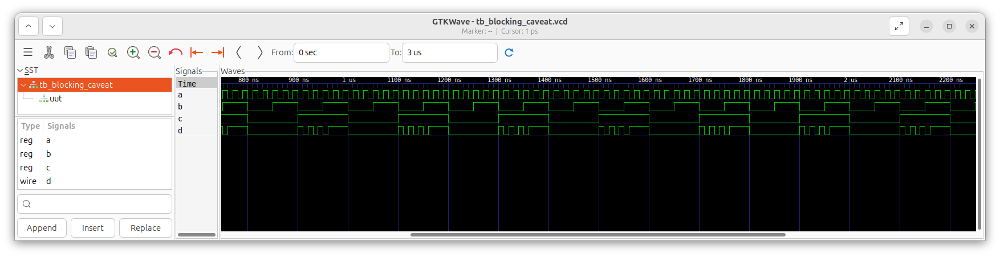
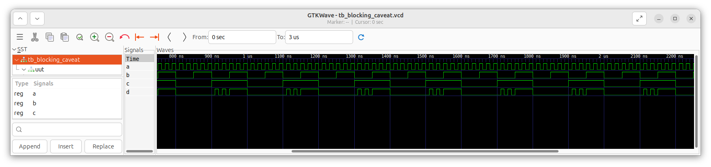

# Day 4: Gate-Level Simulation (GLS), Blocking vs. Non-Blocking in Verilog, and Synthesis-Simulation Mismatch
 
The focus of today will be to explore the importance of Gate-Level Simulation (GLS) and understand common pitfalls that cause synthesis-simulation mismatches. We will begin by learning how GLS validates the logical and timing correctness of a synthesized design. Then, we will study how improper Verilog coding practices—such as incomplete sensitivity lists or misuse of blocking assignments—can lead to mismatches between RTL and gate-level behavior. Finally, we will reinforce these concepts through hands-on lab experiments that compare RTL and GLS results for different designs.

---

## 📜 Table of Contents
[1. Gate Level Simulation (GLS)](#1-gate-level-simulation-gls) <br>
[2. Synthesis-Simulation Mismatch](#2-synthesis-simulation-mismatch) <br>
[3. Lab: Example of Gate Level Synthesis](#3-lab-example-of-gate-level-synthesis) <br>
[4. Lab: Example 1 of Synthesis-Simulation Mismatch](#4-lab-example-1-of-synthesis-simulation-mismatch) <br>
[5. Lab: Example 2 of Synthesis-Simulation Mismatch](#5-lab-example-2-of-synthesis-simulation-mismatch) <br>

---

## 1. Gate Level Simulation (GLS).

### 1. <ins>What is Gate Level Simulation?</ins>
Gate Level Simulation (GLS) is the process of simulating a design using its netlist (post-synthesis representation) instead of the original RTL code. The netlist is logically equivalent to the RTL, but is expressed in terms of gates and flip-flops from the technology library. In GLS, the testbench is run with this netlist as the Design Under Test (DUT).

### 2. <ins>Why GLS is performed?</ins>
   - **Logical Verification**: To confirm that the synthesized netlist still preserves the functionality of the RTL design.
   - **Timing Verification**: To ensure the design meets timing requirements after synthesis and mapping.
     * This requires running GLS with delay annotation, where actual gate and interconnect delays from the library are included.
     * Without delay annotation → only logic correctness is tested.
     * With delay annotation → both functionality and timing correctness are checked.

### 3. <ins>GLS Flow using Icarus Verilog (iverilog).</ins>
   - Inputs to simulator:
     * Netlist (synthesized Verilog).
     * Gate-level Verilog models from the technology library.
     * Testbench.

     iverilog compiles these and produces a `.vcd` file. The `.vcd` file is viewed in GTKWave to analyze outputs, timing, and waveforms.

### 4. <ins>Types of Gate Level Models.</ins>
   - **Functional models**:
     * Contain only logical functionality of each gate (no timing information).
     * Used to quickly check functionality of the design.
   - **Timing-aware models**:
     * Include both logic and delay information (propagation delays, setup/hold checks).
     * Used when verifying timing closure and realistic performance of the circuit.

---

## 2. Synthesis-Simulation Mismatch.

### 1. <ins>What is Synthesis-Simulation Mismatch?</ins>
Synthesis–Simulation Mismatch occurs when the behavior observed during RTL simulation does not match the behavior of the synthesized netlist. This discrepancy creates confusion and can lead to functional errors if not carefully handled.

### 2. <ins>Common Reasons for Mismatch.</ins>
   - **Missing Sensitivity List**:<br>
     In RTL simulation, an `always` block updates only when signals in its sensitivity list change. If the list is incomplete, simulation may not reflect the true intended logic.<br>During synthesis, however, the tool considers the entire logic expression, so hardware works differently than the simulation.
   - **Blocking vs. Non-Blocking Assignments**:
     * Blocking Statement (`=`):
       Executes immediately and blocks the next statement until it finishes. Order of statements matters.
     * Non-Blocking Statement (`<=`):
       Executes in parallel (scheduling the update at the end of the time step). All right-hand sides are evaluated before assignments.
     * How mismatch occurs:
       * Using blocking assignments (`=`) in sequential (`always @(posedge clk)`) logic can create unintended simulation results that do not match the synthesized hardware.
       * Non-blocking assignments (`<=`) are preferred in sequential logic because they correctly model flip-flop behavior.

### 3. <ins>How to Avoid Synthesis–Simulation Mismatch.</ins>
   - Always use complete sensitivity lists (or better, use `always @(*)` for combinational logic).
   - Use non-blocking assignments (`<=`) for sequential logic (flip-flops).
   - Use blocking assignments (`=`) only for combinational logic inside always @(*).
   - Follow proper coding guidelines and verify designs with both RTL and gate-level simulations.

---

## 3. Lab: Example of Gate Level Synthesis.
In this lab, we will look at how to perform Gate Level Simulation (GLS) with the help of a simple lab example. For this purpose, we will use a 2-to-1 multiplexer (MUX) as our design.

### 1. <ins>Verilog Code.</ins>
   - **Code**
     ```
     module ternary_operator_mux (input i0 , input i1 , input sel , output y);
     	assign y = sel?i1:i0;
     	endmodule
     ```
   - **Explanation**
     The design implements a 2-to-1 multiplexer using the ternary operator.
     * Inputs:
       * `i0` → First input
       * `i1` → Second input
       * `sel` → Select signal
     * Outputs:
       * `y` → Selected output
     * Functionality:
       * When `sel = 0`, the output `y` is assigned the value of `i0`.
       * When `sel = 1`, the output `y` is assigned the value of `i1`.

### 2. <ins>GLS Commands Flow.</ins>
> [!NOTE]
> Before proceeding to perform GLS, please perform the RTL simulations using Iverilog and GTKWave, and also synthesize the design and generate the netlist using Yosys. You may refer to [Day 1](https://github.com/BitopanBaishya/VSD-Tapeout-Program-2025---Week-1/blob/main/Day%201/README.md) for reference.
   - **Step 1**: Compile the gate-level netlist, standard cell library models, and testbench into a simulation executable.
     ```
     iverilog [address to your my_lib folder]/my_lib/verilog_model/sky130_fd_sc_hd.v [address to your my_lib folder]/my_lib/verilog_model/primitives.v ternary_operator_mux_netlist.v tb_ternary_operator_mux.v
     ```
   - **Step 2**: Run the simulation.
     ```
     ./a.out
     ```
   - **Step 3**: Open the generated waveform file in GTKWave for analysis of simulation results.
     ```
     gtkwave tb_ternary_operator_mux.vcd
     ```

### 3. <ins>RTL Simulation Waveform.</ins>
  

### 4. <ins>Gate-Level Simulation Waveform.</ins>
  

### 5. <ins>RTL Simulation and Gate-Level Simulation Analysis.</ins>
On comparing the waveforms obtained from the RTL simulation and the Gate Level Simulation (GLS), it is observed that both produce identical outputs for the given set of inputs. This indicates that the synthesized netlist preserves the intended logical behavior of the RTL design. Since there is no deviation between the RTL and GLS results, we can conclude that there is no synthesis-simulation mismatch in this design.

---

## 4. Lab: Example 1 of Synthesis-Simulation Mismatch.
In this lab, we will look at an example of Synthesis-Simulation Mismatch and analyse its reason.

### 1. <ins>Verilog Code.</ins>
   - **Code**
     ```
     module bad_mux (input i0 , input i1 , input sel , output reg y);
     always @ (sel)
     begin
     	if(sel)
     		y <= i1;
     	else 
     		y <= i0;
     end
     endmodule
     ```
   - **Explanation**
     The module `bad_mux` describes a 2:1 multiplexer using an `always` block. The output `y` is declared as a `reg` type and is updated based on the value of the select signal `sel`.
     * If `sel = 1`, then `y` is assigned the value of `i1`.
     * If `sel = 0`, then `y` is assigned the value of `i0`.

### 2. <ins>RTL Simulation Waveform.</ins>
  

### 3. <ins>Gate-Level Simulation Waveform.</ins>
  

### 4. <ins>RTL Simulation and Gate-Level Simulation Analysis.</ins>
On comparing the waveforms obtained from the RTL simulation and the Gate Level Simulation (GLS) of the `bad_mux` design, clear differences are observed in the output behavior. While the RTL simulation responds correctly to changes in inputs `i0` and `i1`, the GLS output does not reflect these changes consistently.<br>
This discrepancy arises because the `always` block in the Verilog code has an incomplete sensitivity list, with only the `sel` signal included. As a result, in RTL simulation, the simulator updates the output only when `sel` changes, while in synthesis the tool assumes a complete sensitivity list and implements the correct hardware logic.<br>
Hence, this example demonstrates a classic case of synthesis-simulation mismatch caused by improper coding style.

---

## 5. Lab: Example 2 of Synthesis-Simulation Mismatch.
In this lab, we will look at another example of Synthesis-Simulation Mismatch and analyse its reason.

### 1. <ins>Verilog Code.</ins>
   - **Code**
     ```
     module blocking_caveat (input a , input b , input  c, output reg d); 
     reg x;
     always @ (*)
     begin
     	d = x & c;
     	x = a | b;
     end
     endmodule
     ```
   - **Explanation**
     * `d = x & c;` → `d` is assigned the logical AND of `x` and `c`.
     * `x = a | b;` → `x` is assigned the logical OR of `a` and `b`.
     * So, in this code:
       * The output `d` depends on the value of `x` and `c`.
       * The signal `x` is updated as the OR of inputs `a` and `b`

### 2. <ins>RTL Simulation Waveform.</ins>
  

### 3. <ins>Gate-Level Simulation Waveform.</ins>
  

### 4. <ins>RTL Simulation and Gate-Level Simulation Analysis.</ins>
On comparing the RTL simulation and Gate Level Simulation (GLS) results of the `blocking_caveat` design, differences are observed in the output signal `d`. In RTL simulation, the assignments inside the `always` block are executed sequentially using blocking assignments, which makes the value of `d` depend on the old value of `x`. However, in GLS, the synthesized hardware reflects the actual combinational logic, where `d` should be computed using the updated value of `x`.<br>
This mismatch arises due to the use of blocking assignments in an incorrect order, leading to different behaviors in simulation versus synthesis. Thus, this example illustrates a classic synthesis-simulation mismatch caused by blocking statements.


