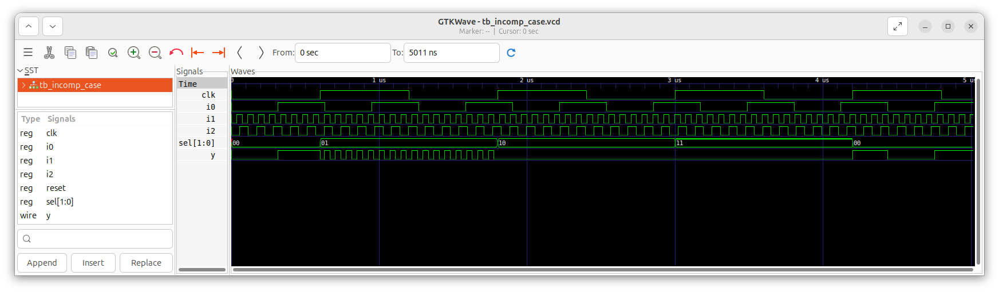

# Day 4: Gate-Level Simulation (GLS), Blocking vs. Non-Blocking in Verilog, and Synthesis-Simulation Mismatch
 
The focus of today will be 

---

## 📜 Table of Contents
[1. If-Else and Case Statements in Verilog)](#1-if-else-and-case-statements-in-verilog) <br>
[2. Inferred Latches in Verilog](#2-inferred-latches-in-verilog)<br>
[3. Labs: Inferred Latch due to Incomplete `if` Constructs](#3-labs-inferred-latch-due-to-incomplete-if-constructs)<br>
[4. Labs: Inferred Latch due to Incomplete `case` Constructs](#4-labs-inferred-latch-due-to-incomplete-case-constructs)<br>

---

## 1. If-Else and Case Statements in Verilog.

### 1. <ins>If-Else Statements</ins>
The `if-else` construct is used to describe conditional decision-making in Verilog.
   - **Syntax:**:
     ```
     always @(*) begin
     if (condition1)
         statement1;
     else if (condition2)
         statement2;
     else
         statementN;
     end
     ```
   - **Priority Order:**:
     * In `if-else` chains, priority is inherent.
     * The first condition has the highest priority, and once a condition evaluates as true, the remaining conditions are not checked.

### 2. <ins>Case Statements</ins>
The `case` construct provides a structured way to select one of many possible actions based on the value of a variable or expression.
   - **Syntax:**:
     ```
     always @(*) begin
     case (expression)
         value1: statement1;
         value2: statement2;
         default: statementN;
     endcase
     end
     ```
   - **No Priority Order:**:
     * Unlike `if-else`, `case` statements do not assign priority to conditions.
     * All possible cases are compared against the expression, even if one match is already found.

### 3. <ins>Common Rules for Both</ins>
   - Both `if-else` and `case` constructs are written inside an `always` block.
   - The variables assigned within these statements must be declared as `reg` type in Verilog.

---

## 2. Inferred Latches in Verilog.

### 1. <ins>What are inferred latches?</ins>
**Inferred latches** occur when synthesis tools unintentionally create latch hardware due to incomplete specification of logic in conditional statements. They usually happen when the output of a combinational block is not defined for all possible input conditions.

### 2. <ins>Some common causes of inferred latches.</ins>

- **Caveats in If-Else Statements**:
  * If an `if-else` chain is incomplete (e.g., missing an else branch), some input conditions may leave outputs unchanged. This causes synthesis tools to infer storage elements (latches) to hold the previous output.

- **Caveats in Case Statements**:
  * **Missing default case**:
    Without a `default`, some input combinations may not assign a value, leading to latch inference.
  * **Partial assignments**:
    Even if `default` is present, if not all output variables are assigned in every case, latches may still be inferred. To avoid this, assign all outputs in all cases.
  * **Overlapping cases**:
    In `case` statements, there is no priority order. If overlapping cases are written, multiple conditions may match, creating unpredictable outputs. To avoid this, ensure mutually exclusive cases.

---

## 3. Labs: Inferred Latch due to Incomplete `if` Constructs.
In these labs, we will look at Inferred Latch formation due to Incomplete `if` constructs.

### 1. <ins>Lab 1.</ins>
   - **Verilog Code:**
     ```
     module incomp_if (input i0 , input i1 , input i2 , output reg y);
     always @ (*)
     begin
     	if(i0)
     		y <= i1;
     end
     endmodule
     ```
   - **Explanation:**<br>
     The module `incomp_if` describes a simple conditional assignment using an `if` statement. The output `y` is declared as a `reg` type.
     * If `i0 = 1`, then `y` is assigned the value of `i1`.
     * If `i0 = 0`, then `y` retains its previous value, since no assignment is specified.
   - **RTL Simulation Waveform:**
     
   - **Schematic after Synthesis:**
     
   - **Analysis of the Waveform and Schematic:**<br>
     From the RTL simulation and the synthesized schematic of the `incomp_if` design, it is observed that the output behavior indicates the formation of an inferred latch. While the RTL simulation shows that `y` takes the value of `i1` when `i0 = 1`, it retains its previous value when `i0 = 0`, since no assignment is specified in that case. During synthesis, Yosys interprets this retention of the previous value as requiring storage, and therefore infers a latch to hold the output.<br>
     This discrepancy arises due to the incomplete `if` statement without a corresponding `else` branch. As a result, the hardware implementation differs from the intended purely combinational behavior.<br>
     Hence, this example demonstrates how incomplete conditional statements can lead to unintended latch inference, which is generally undesirable in digital design.

### 2. <ins>Lab 2.</ins>
   - **Verilog Code:**
     ```
     module incomp_if2 (input i0 , input i1 , input i2 , input i3, output reg y);
     always @ (*)
     begin
     	if(i0)
     		y <= i1;
     	else if (i2)
     		y <= i3;
     end
     endmodule
     ```
   - **Explanation:**<br>
     The module `incomp_if2` describes a conditional logic block using an `always` block. The output `y` is declared as a `reg` type and is updated based on the values of `i0` and `i2`.
     * If `i0 = 1`, then `y` is assigned the value of `i1`.
     * If `i0 = 0` and `i2 = 1`, then `y` is assigned the value of `i3`.
     * If both `i0 = 0` and `i2 = 0`, then `y` retains its previous value since no assignment is specified.
   - **RTL Simulation Waveform:**
     
   - **Schematic after Synthesis:**
     
   - **Analysis of the Waveform and Schematic:**<br>
     From the RTL simulation and the synthesized schematic of the `incomp_if2` design, it is observed that the output `y` does not behave consistently when both `i0 = 0` and `i2 = 0`. In RTL simulation, `y` retains its previous value in such cases, while Yosys synthesis infers storage elements to preserve this behavior.<br>
     This happens because the `if-else` chain in the Verilog code is incomplete, with no `else` branch to define the value of `y` when neither `i0` nor `i2` is asserted. As a result, Yosys introduces a latch to hold the last assigned value of `y`, leading to an inferred latch in the hardware.<br>
     Hence, this example demonstrates that incomplete conditional constructs in Verilog can unintentionally create inferred latches, which may cause differences between intended combinational logic and the synthesized hardware implementation.

---

## 4. Labs: Inferred Latch due to Incomplete `case` Constructs.
In these labs, we will look at Inferred Latch formation due to Incomplete `case` constructs.

### 1. <ins>Lab 1.</ins>
   - **Verilog Code:**
     ```
     module incomp_case (input i0 , input i1 , input i2 , input [1:0] sel, output reg y);
     always @ (*)
     begin
     	case(sel)
     		2'b00 : y = i0;
     		2'b01 : y = i1;
     	endcase
     end
     endmodule
     ```
   - **Explanation:**<br>
     The module `incomp_case` implements a multiplexer using a `case` statement. The output `y` is assigned based on the 2-bit select signal `sel`.
     * If `sel = 2'b00`, then `y` is assigned the value of `i0`.
     * If `sel = 2'b01`, then `y` is assigned the value of `i1`.
     * For all other values of `sel` (i.e., `2'b10` and `2'b11`), no assignment is specified.
   - **RTL Simulation Waveform:**
     
   - **Schematic after Synthesis:**
     
   - **Analysis of the Waveform and Schematic:**<br>
     From the RTL simulation and the Yosys-synthesized schematic of the `incomp_case` design, it is observed that the output `y` retains its previous value when `sel` is `2'b10` or `2'b11`.<br>
     This happens because the `case` statement only defines `y` for `2'b00` and `2'b01`, leaving other cases unspecified. To preserve the last value of `y` for these undefined inputs, Yosys infers a latch.<br>
     Thus, both simulation and synthesis confirm an inferred latch, showing that incomplete conditional constructs in Verilog can unintentionally create storage elements instead of purely combinational logic.

### 2. <ins>Lab 2.</ins>
   - **Verilog Code:**
     ```
     module comp_case (input i0 , input i1 , input i2 , input [1:0] sel, output reg y);
     always @ (*)
     begin
     	case(sel)
     		2'b00 : y = i0;
     		2'b01 : y = i1;
     		default : y = i2;
     	endcase
     end
     endmodule
     ```
   - **Explanation:**<br>
     The module `comp_case` implements a multiplexer using a `case` statement. The output `y` is assigned based on the 2-bit select signal `sel`.
     * If `sel = 2'b00`, then `y` is assigned the value of `i0`.
     * If `sel = 2'b01`, then `y` is assigned the value of `i1`.
     * For all other values of `sel` (`2'b10` or `2'b11`), the default branch ensures that `y` is assigned the value of `i2`.<br>
       This use of the `default` branch ensures that `y` is defined for every possible input combination of `sel`, preventing the inference of latches and making the logic fully combinational.
   - **RTL Simulation Waveform:**
     
   - **Schematic after Synthesis:**
     
   - **Analysis of the Waveform and Schematic:**<br>
     From the RTL simulation and the Yosys-synthesized schematic of the `comp_case` design, it is observed that the output `y` behaves consistently for all values of `sel`.<br>
     This is because the `case` statement includes a default branch that assigns `y` when `sel` is not `2'b00` or `2'b01`. With all possible input combinations covered, Yosys does not infer any latches, and the logic is implemented purely as combinational circuitry.<br>
     Thus, both simulation and synthesis confirm that no inferred latch is created, demonstrating that a complete conditional construct in Verilog ensures fully defined combinational behavior.

### 3. <ins>Lab 3.</ins>
   - **Verilog Code:**
     ```
     module partial_case_assign (input i0 , input i1 , input i2 , input [1:0] sel, output reg y , output reg x);
     always @ (*)
     begin
     	case(sel)
     		2'b00 : begin
     			y = i0;
	     		x = i2;
	     		end
     		2'b01 : y = i1;
     		default : begin
     		           x = i1;
	          		   y = i2;
	     		  end
     	endcase
     end
     endmodule
     ```
   - **Explanation:**<br>
     The module `partial_case_assign` implements a multiplexer-like behavior for two outputs, `y` and `x`, based on the 2-bit select signal `sel`.
     * If `sel = 2'b00`, then:
       * `y` is assigned the value of `i0`.
       * `x` is assigned the value of `i2`.
     * If `sel = 2'b01`, then:
       * Only `y` is assigned the value of `i1`.
       * `x` is not assigned in this branch.
     * For all other values of `sel` (`default` case, i.e., `2'b10` or `2'b11`), then:
       * `y` is assigned the value of `i2`.
       * `x` is assigned the value of `i1`.<br>
       Because not all branches assign both outputs (specifically, `x` is not assigned when `sel = 2'b01`), this code may lead to inferred latches for `x` in synthesis. The latch would hold the previous value of `x` when `sel = 2'b01`, while `y` is fully defined for all cases.
   - **RTL Simulation Waveform:**
     
   - **Schematic after Synthesis:**
     
   - **Analysis of the Waveform and Schematic:**<br>
     From the RTL simulation and the Yosys-synthesized schematic of the `partial_case_assign` design, it is observed that the output `y` behaves consistently for all values of `sel`, while `x` retains its previous value when `sel = 2'b01`.<br>
     This happens because the `case` statement does not assign `x` in the `2'b01` branch. In Verilog, when an output is not assigned in all branches of a combinational always @(*) block, Yosys infers a latch to preserve its last value. Consequently, `x` is implemented as a storage element, whereas `y` remains purely combinational due to being assigned in all cases.

### 4. <ins>Lab 4.</ins>
   - **Verilog Code:**
     ```
     module bad_case (input i0 , input i1, input i2, input i3 , input [1:0] sel, output reg y);
     always @(*)
     begin
     	case(sel)
     		2'b00: y = i0;
	     	2'b01: y = i1;
	     	2'b10: y = i2;
	     	2'b1?: y = i3;
     	endcase
     end
     endmodule
     ```
   - **Explanation:**<br>
     The module `bad_case` implements a multiplexer using a `case` statement with a 2-bit select signal `sel`. The output `y` is assigned based on the value of `sel`.
     * If `sel = 2'b00`, then `y` is assigned the value of `i0`.
     * If `sel = 2'b01`, then `y` is assigned the value of `i1`.
     * If `sel = 2'b10`, then `y` is assigned the value of `i2`.
     * The last case, `2'b1?`, is a wildcard case intended to match any value where the MSB of `sel` is 1 (i.e., `2'b10` or `2'b11`). In Verilog, using `?` in a `case` statement is not standard syntax in most tools and may cause unpredictable behavior in simulation or synthesis.<br>
       Because some `sel` values may match multiple branches ambiguously (especially `2'b10`, which matches both `2'b10` and `2'b1?`), this code can lead to inconsistent behavior or inferred latches depending on the tool.
   - **RTL Simulation Waveform:**
     
   - **Schematic after Synthesis:**
     
   - **Analysis of the Waveform and Schematic:**<br>
     From the RTL simulation and the Yosys-synthesized schematic of the `bad_case` design, it is observed that the output `y` may behave inconsistently for certain values of `sel`. In particular, when `sel = 2'b10` or `2'b11`, the assignment to `y` can be ambiguous due to overlapping or improperly specified case patterns.<br>
     This happens because the `case` statement includes a non-standard wildcard branch (`2'b1?`) that can overlap with explicitly defined cases. Since not all input conditions are uniquely and fully defined, Yosys may infer a latch to hold the previous value of `y` for certain `sel` values, leading to unintended storage behavior.<br>
     Thus, both RTL simulation and synthesis confirm that improper or overlapping case patterns can result in inferred latches, illustrating that careful, complete, and non-ambiguous case specifications are necessary to ensure fully combinational logic.


