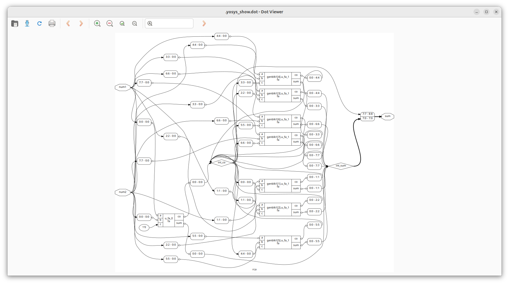

# Day 4: Gate-Level Simulation (GLS), Blocking vs. Non-Blocking in Verilog, and Synthesis-Simulation Mismatch
 
The focus of today will be 

---

## 📜 Table of Contents
[1. If-Else and Case Statements in Verilog)](#1-if-else-and-case-statements-in-verilog) <br>
[2. Inferred Latches in Verilog](#2-inferred-latches-in-verilog)<br>
[3. Labs: Inferred Latch due to Incomplete `if` Constructs](#3-labs-inferred-latch-due-to-incomplete-if-constructs)<br>
[4. Labs: Inferred Latch due to Incomplete `case` Constructs](#4-labs-inferred-latch-due-to-incomplete-case-constructs)<br>
[5. Looping Constructs in Verilog](#5-looping-constructs-in-verilog)<br>
[6. Labs: Looping Constructs in Verilog]()<br>

---

## 1. If-Else and Case Statements in Verilog.

### 1. <ins>If-Else Statements</ins>
The `if-else` construct is used to describe conditional decision-making in Verilog.
   - **Syntax:**:
     ```
     always @(*) begin
     if (condition1)
         statement1;
     else if (condition2)
         statement2;
     else
         statementN;
     end
     ```
   - **Priority Order:**:
     * In `if-else` chains, priority is inherent.
     * The first condition has the highest priority, and once a condition evaluates as true, the remaining conditions are not checked.

### 2. <ins>Case Statements</ins>
The `case` construct provides a structured way to select one of many possible actions based on the value of a variable or expression.
   - **Syntax:**:
     ```
     always @(*) begin
     case (expression)
         value1: statement1;
         value2: statement2;
         default: statementN;
     endcase
     end
     ```
   - **No Priority Order:**:
     * Unlike `if-else`, `case` statements do not assign priority to conditions.
     * All possible cases are compared against the expression, even if one match is already found.

### 3. <ins>Common Rules for Both</ins>
   - Both `if-else` and `case` constructs are written inside an `always` block.
   - The variables assigned within these statements must be declared as `reg` type in Verilog.

---

## 2. Inferred Latches in Verilog.

### 1. <ins>What are inferred latches?</ins>
**Inferred latches** occur when synthesis tools unintentionally create latch hardware due to incomplete specification of logic in conditional statements. They usually happen when the output of a combinational block is not defined for all possible input conditions.

### 2. <ins>Some common causes of inferred latches.</ins>

- **Caveats in If-Else Statements**:
  * If an `if-else` chain is incomplete (e.g., missing an else branch), some input conditions may leave outputs unchanged. This causes synthesis tools to infer storage elements (latches) to hold the previous output.

- **Caveats in Case Statements**:
  * **Missing default case**:
    Without a `default`, some input combinations may not assign a value, leading to latch inference.
  * **Partial assignments**:
    Even if `default` is present, if not all output variables are assigned in every case, latches may still be inferred. To avoid this, assign all outputs in all cases.
  * **Overlapping cases**:
    In `case` statements, there is no priority order. If overlapping cases are written, multiple conditions may match, creating unpredictable outputs. To avoid this, ensure mutually exclusive cases.

---

## 3. Labs: Inferred Latch due to Incomplete `if` Constructs.
In these labs, we will look at Inferred Latch formation due to Incomplete `if` constructs.

### 1. <ins>Lab 1.</ins>
   - **Verilog Code:**
     ```
     module incomp_if (input i0 , input i1 , input i2 , output reg y);
     always @ (*)
     begin
     	if(i0)
     		y <= i1;
     end
     endmodule
     ```
   - **Explanation:**<br>
     The module `incomp_if` describes a simple conditional assignment using an `if` statement. The output `y` is declared as a `reg` type.
     * If `i0 = 1`, then `y` is assigned the value of `i1`.
     * If `i0 = 0`, then `y` retains its previous value, since no assignment is specified.
   - **RTL Simulation Waveform:**
     
   - **Schematic after Synthesis:**
     
   - **Analysis of the Waveform and Schematic:**<br>
     From the RTL simulation and the synthesized schematic of the `incomp_if` design, it is observed that the output behavior indicates the formation of an inferred latch. While the RTL simulation shows that `y` takes the value of `i1` when `i0 = 1`, it retains its previous value when `i0 = 0`, since no assignment is specified in that case. During synthesis, Yosys interprets this retention of the previous value as requiring storage, and therefore infers a latch to hold the output.<br>
     This discrepancy arises due to the incomplete `if` statement without a corresponding `else` branch. As a result, the hardware implementation differs from the intended purely combinational behavior.<br>
     Hence, this example demonstrates how incomplete conditional statements can lead to unintended latch inference, which is generally undesirable in digital design.

### 2. <ins>Lab 2.</ins>
   - **Verilog Code:**
     ```
     module incomp_if2 (input i0 , input i1 , input i2 , input i3, output reg y);
     always @ (*)
     begin
     	if(i0)
     		y <= i1;
     	else if (i2)
     		y <= i3;
     end
     endmodule
     ```
   - **Explanation:**<br>
     The module `incomp_if2` describes a conditional logic block using an `always` block. The output `y` is declared as a `reg` type and is updated based on the values of `i0` and `i2`.
     * If `i0 = 1`, then `y` is assigned the value of `i1`.
     * If `i0 = 0` and `i2 = 1`, then `y` is assigned the value of `i3`.
     * If both `i0 = 0` and `i2 = 0`, then `y` retains its previous value since no assignment is specified.
   - **RTL Simulation Waveform:**
     
   - **Schematic after Synthesis:**
     
   - **Analysis of the Waveform and Schematic:**<br>
     From the RTL simulation and the synthesized schematic of the `incomp_if2` design, it is observed that the output `y` does not behave consistently when both `i0 = 0` and `i2 = 0`. In RTL simulation, `y` retains its previous value in such cases, while Yosys synthesis infers storage elements to preserve this behavior.<br>
     This happens because the `if-else` chain in the Verilog code is incomplete, with no `else` branch to define the value of `y` when neither `i0` nor `i2` is asserted. As a result, Yosys introduces a latch to hold the last assigned value of `y`, leading to an inferred latch in the hardware.<br>
     Hence, this example demonstrates that incomplete conditional constructs in Verilog can unintentionally create inferred latches, which may cause differences between intended combinational logic and the synthesized hardware implementation.

---

## 4. Labs: Inferred Latch due to Incomplete `case` Constructs.
In these labs, we will look at Inferred Latch formation due to Incomplete `case` constructs.

### 1. <ins>Lab 1.</ins>
   - **Verilog Code:**
     ```
     module incomp_case (input i0 , input i1 , input i2 , input [1:0] sel, output reg y);
     always @ (*)
     begin
     	case(sel)
     		2'b00 : y = i0;
     		2'b01 : y = i1;
     	endcase
     end
     endmodule
     ```
   - **Explanation:**<br>
     The module `incomp_case` implements a multiplexer using a `case` statement. The output `y` is assigned based on the 2-bit select signal `sel`.
     * If `sel = 2'b00`, then `y` is assigned the value of `i0`.
     * If `sel = 2'b01`, then `y` is assigned the value of `i1`.
     * For all other values of `sel` (i.e., `2'b10` and `2'b11`), no assignment is specified.
   - **RTL Simulation Waveform:**
     
   - **Schematic after Synthesis:**
     
   - **Analysis of the Waveform and Schematic:**<br>
     From the RTL simulation and the Yosys-synthesized schematic of the `incomp_case` design, it is observed that the output `y` retains its previous value when `sel` is `2'b10` or `2'b11`.<br>
     This happens because the `case` statement only defines `y` for `2'b00` and `2'b01`, leaving other cases unspecified. To preserve the last value of `y` for these undefined inputs, Yosys infers a latch.<br>
     Thus, both simulation and synthesis confirm an inferred latch, showing that incomplete conditional constructs in Verilog can unintentionally create storage elements instead of purely combinational logic.

### 2. <ins>Lab 2.</ins>
   - **Verilog Code:**
     ```
     module comp_case (input i0 , input i1 , input i2 , input [1:0] sel, output reg y);
     always @ (*)
     begin
     	case(sel)
     		2'b00 : y = i0;
     		2'b01 : y = i1;
     		default : y = i2;
     	endcase
     end
     endmodule
     ```
   - **Explanation:**<br>
     The module `comp_case` implements a multiplexer using a `case` statement. The output `y` is assigned based on the 2-bit select signal `sel`.
     * If `sel = 2'b00`, then `y` is assigned the value of `i0`.
     * If `sel = 2'b01`, then `y` is assigned the value of `i1`.
     * For all other values of `sel` (`2'b10` or `2'b11`), the default branch ensures that `y` is assigned the value of `i2`.<br>
       This use of the `default` branch ensures that `y` is defined for every possible input combination of `sel`, preventing the inference of latches and making the logic fully combinational.
   - **RTL Simulation Waveform:**
     
   - **Schematic after Synthesis:**
     
   - **Analysis of the Waveform and Schematic:**<br>
     From the RTL simulation and the Yosys-synthesized schematic of the `comp_case` design, it is observed that the output `y` behaves consistently for all values of `sel`.<br>
     This is because the `case` statement includes a default branch that assigns `y` when `sel` is not `2'b00` or `2'b01`. With all possible input combinations covered, Yosys does not infer any latches, and the logic is implemented purely as combinational circuitry.<br>
     Thus, both simulation and synthesis confirm that no inferred latch is created, demonstrating that a complete conditional construct in Verilog ensures fully defined combinational behavior.

### 3. <ins>Lab 3.</ins>
   - **Verilog Code:**
     ```
     module partial_case_assign (input i0 , input i1 , input i2 , input [1:0] sel, output reg y , output reg x);
     always @ (*)
     begin
     	case(sel)
     		2'b00 : begin
     			y = i0;
	     		x = i2;
	     		end
     		2'b01 : y = i1;
     		default : begin
     		           x = i1;
	          		   y = i2;
	     		  end
     	endcase
     end
     endmodule
     ```
   - **Explanation:**<br>
     The module `partial_case_assign` implements a multiplexer-like behavior for two outputs, `y` and `x`, based on the 2-bit select signal `sel`.
     * If `sel = 2'b00`, then:
       * `y` is assigned the value of `i0`.
       * `x` is assigned the value of `i2`.
     * If `sel = 2'b01`, then:
       * Only `y` is assigned the value of `i1`.
       * `x` is not assigned in this branch.
     * For all other values of `sel` (`default` case, i.e., `2'b10` or `2'b11`), then:
       * `y` is assigned the value of `i2`.
       * `x` is assigned the value of `i1`.<br>
       Because not all branches assign both outputs (specifically, `x` is not assigned when `sel = 2'b01`), this code may lead to inferred latches for `x` in synthesis. The latch would hold the previous value of `x` when `sel = 2'b01`, while `y` is fully defined for all cases.
   - **RTL Simulation Waveform:**
     
   - **Schematic after Synthesis:**
     
   - **Analysis of the Waveform and Schematic:**<br>
     From the RTL simulation and the Yosys-synthesized schematic of the `partial_case_assign` design, it is observed that the output `y` behaves consistently for all values of `sel`, while `x` retains its previous value when `sel = 2'b01`.<br>
     This happens because the `case` statement does not assign `x` in the `2'b01` branch. In Verilog, when an output is not assigned in all branches of a combinational always @(*) block, Yosys infers a latch to preserve its last value. Consequently, `x` is implemented as a storage element, whereas `y` remains purely combinational due to being assigned in all cases.

### 4. <ins>Lab 4.</ins>
   - **Verilog Code:**
     ```
     module bad_case (input i0 , input i1, input i2, input i3 , input [1:0] sel, output reg y);
     always @(*)
     begin
     	case(sel)
     		2'b00: y = i0;
	     	2'b01: y = i1;
	     	2'b10: y = i2;
	     	2'b1?: y = i3;
     	endcase
     end
     endmodule
     ```
   - **Explanation:**<br>
     The module `bad_case` implements a multiplexer using a `case` statement with a 2-bit select signal `sel`. The output `y` is assigned based on the value of `sel`.
     * If `sel = 2'b00`, then `y` is assigned the value of `i0`.
     * If `sel = 2'b01`, then `y` is assigned the value of `i1`.
     * If `sel = 2'b10`, then `y` is assigned the value of `i2`.
     * The last case, `2'b1?`, is a wildcard case intended to match any value where the MSB of `sel` is 1 (i.e., `2'b10` or `2'b11`). In Verilog, using `?` in a `case` statement is not standard syntax in most tools and may cause unpredictable behavior in simulation or synthesis.<br>
       Because some `sel` values may match multiple branches ambiguously (especially `2'b10`, which matches both `2'b10` and `2'b1?`), this code can lead to inconsistent behavior or inferred latches depending on the tool.
   - **RTL Simulation Waveform:**
     
   - **Schematic after Synthesis:**
     
   - **Analysis of the Waveform and Schematic:**<br>
     From the RTL simulation and the Yosys-synthesized schematic of the `bad_case` design, it is observed that the output `y` may behave inconsistently for certain values of `sel`. In particular, when `sel = 2'b10` or `2'b11`, the assignment to `y` can be ambiguous due to overlapping or improperly specified case patterns.<br>
     This happens because the `case` statement includes a non-standard wildcard branch (`2'b1?`) that can overlap with explicitly defined cases. Since not all input conditions are uniquely and fully defined, Yosys may infer a latch to hold the previous value of `y` for certain `sel` values, leading to unintended storage behavior.<br>
     Thus, both RTL simulation and synthesis confirm that improper or overlapping case patterns can result in inferred latches, illustrating that careful, complete, and non-ambiguous case specifications are necessary to ensure fully combinational logic.

---

## 5. Looping Constructs in Verilog.
Looping constructs in Verilog are special coding techniques that allow designers to reuse code efficiently when describing hardware. Unlike software loops, they do not create runtime iterations; instead, they help describe or generate hardware structures at the time of synthesis or simulation.

### 1. <ins>Types of Looping Constructs.</ins>
- `for` loop (inside `always` block):
  * **Usage**: Within procedural blocks (`always`, `initial`).
  * **Purpose**: Iterates over statements for evaluating expressions or operating on data. Does not instantiate hardware.
  * **General Syntax**:
    ```
    always @(*) begin
    integer i;
       for (i = 0; i < N; i = i + 1) begin
          // procedural statements
     end
    end
    ```

- `generate for` loop (outside `always` block):
  * **Usage**: Outside procedural blocks.
  * **Purpose**: Instantiates hardware multiple times during synthesis.
  * **General Syntax**:
    ```
    genvar j;
    generate
       for (j = 0; j < N; j = j + 1) begin : label
           // module instantiation or logic
       end
    endgenerate
    ```

- `generate-if` construct:
  * **Usage**: Outside procedural blocks.
  * **Purpose**: Conditionally generates hardware if the condition is true. Great for parameterized designs.
  * **General Syntax**:
    ```
    generate
       if (CONDITION) begin : label1
           // hardware to generate if condition is true
       end else begin : label2
           // alternative hardware
       end
    endgenerate
    ```

### 2. <ins>Ripple Carry Adder (RCA).</ins>
One of the most common applications of `generate` loops is in building adders. A Ripple Carry Adder is a chain of full adders, where the carry-out of one full adder is connected to the carry-in of the next. By instantiating multiple full adders in sequence, we can construct an n-bit adder.<br>
Using a `generate for` loop makes this instantiation clean, scalable, and efficient, avoiding repetitive manual coding.

---

## 6. Labs: Looping Constructs in Verilog.
In these labs, we will look at the usage of looping constructs in Verilog.

### 1. <ins>Lab 1.</ins>
   - **Verilog Code:**
     ```
     module mux_generate (input i0 , input i1, input i2 , input i3 , input [1:0] sel  , output reg y);
     wire [3:0] i_int;
     assign i_int = {i3,i2,i1,i0};
     integer k;
     always @ (*)
     begin
     for(k = 0; k < 4; k=k+1) begin
    	if(k == sel)
	     	y = i_int[k];
     end
     end
     endmodule
     ```
   - **Explanation:**
     The module `mux_generate` implements a 4-to-1 multiplexer using a `for` loop inside an `always` block. The output `y` is assigned based on the 2-bit select signal `sel`.
     * The four inputs `i0`, `i1`, `i2`, and `i3` are first packed into a 4-bit vector `i_int = {i3, i2, i1, i0}`.
     * A `for` loop iterates over all indices `k = 0 to 3`.
       * When `k` matches the value of `sel`, `y` is assigned `i_int[k]`.
     * Effectively, this means:
       * If `sel = 2'b00`, `y = i0`.
       * If `sel = 2'b01`, `y = i1`.
       * If `sel = 2'b10`, `y = i2`.
       * If `sel = 2'b11`, `y = i3`.
   - **RTL Simulation:**
     
   - **Schematic after Synthesis in Yosys:**
     
   - **Gate-Level Simulation:**
     
   - **Final Analysis:**
     From the RTL simulation, gate-level simulation, and the Yosys-synthesized schematic of the `mux_generate` design, it is observed that the output `y` behaves correctly according to the select signal `sel` in both simulations.<br>
	 However, the synthesized schematic shows a D-latch for `y`. This occurs because the assignment to `y` is conditional inside the `fo`r loop (`if (k == sel)`) within the procedural `always @(*)` block. Since Yosys detects a path where `y` may not be assigned during synthesis, it infers a latch to hold the previous value, ensuring defined behavior.<br>
	 Thus, both RTL and gate-level simulations confirm correct functional behavior, while the synthesis highlights that conditional assignments without a default value can unintentionally create storage elements. Adding a default assignment to `y` at the start of the `always` block would remove the inferred latch and ensure fully combinational logic.

### 2. <ins>Lab 2.</ins>
   - **Verilog Code:**
     ```
     module demux_case (output o0 , output o1, output o2 , output o3, output o4, output o5, output o6 , output o7 , input [2:0] sel  , input i);
     reg [7:0]y_int;
     assign {o7,o6,o5,o4,o3,o2,o1,o0} = y_int;
     integer k;
     always @ (*)
     begin
     y_int = 8'b0;
     	case(sel)
	     	3'b000 : y_int[0] = i;
	     	3'b001 : y_int[1] = i;
	     	3'b010 : y_int[2] = i;
	     	3'b011 : y_int[3] = i;
	     	3'b100 : y_int[4] = i;
	     	3'b101 : y_int[5] = i;
	     	3'b110 : y_int[6] = i;
	     	3'b111 : y_int[7] = i;
	     endcase
     end
     endmodule
     ```
   - **Explanation:**
     The module `demux_case` implements an 8-to-1 demultiplexer using a `case` statement. The single input `i` is routed to one of the eight outputs (`o0`–`o7`) based on the 3-bit select signal `sel`.
     * An internal 8-bit register `y_int` is used to hold the output values.
     * At the start of the `always @(*)` block, `y_int` is initialized to `8'b0` to ensure only one line is active at a time.
     * The `case` statement then activates exactly one bit of `y_int` according to the value of `sel`:
       * If `sel = 3'b000`, then `y_int[0] = i` → output `o0` is driven by `i`.
       * If `sel = 3'b001`, then `y_int[1] = i` → output `o1` is driven by `i`.
       * If `sel = 3'b010`, then `y_int[2] = i` → output `o2` is driven by `i`.
       * … and so on, until `sel = 3'b111`, where `y_int[7] = i` → output `o7` is driven by `i`.
     * Finally, the assignment `assign {o7,o6,o5,o4,o3,o2,o1,o0} = y_int;` maps the internal register `y_int` to the actual output ports.
   - **RTL Simulation:**
     
   - **Schematic after Synthesis in Yosys:**
     
   - **Gate-Level Simulation:**
     
   - **Final Analysis:**
     From the RTL simulation, gate-level simulation, and the Yosys-synthesized schematic of the `demux_case` design, it is observed that the output lines behave exactly as expected for all values of the select signal `sel`. For any given input `i`, only the output corresponding to the selected index is asserted, while all other outputs remain `0`.<br>
	 This happens because the design uses an internal register `y_int`, which is reset to `8'b0` at the start of the `always @(*)` block. The case statement then assigns `i` to the appropriate bit of `y_int` based on `sel`. Since every possible value of `sel` is explicitly covered, the outputs are fully defined, and no latches are inferred during synthesis.<br>
	 Thus, both RTL and gate-level simulations match perfectly with the synthesized schematic, confirming that the design implements a purely combinational 1-to-8 demultiplexer without any unintended storage elements.

### 3. <ins>Lab 3.</ins>
   - **Verilog Code:**
     ```
     module demux_generate (output o0 , output o1, output o2 , output o3, output o4, output o5, output o6 , output o7 , input [2:0] sel  , input i);
     reg [7:0]y_int;
     assign {o7,o6,o5,o4,o3,o2,o1,o0} = y_int;
     integer k;
     always @ (*)
     begin
     y_int = 8'b0;
     for(k = 0; k < 8; k++) begin
     	if(k == sel)
	     	y_int[k] = i;
     end
     end
     endmodule
     ```
   - **Explanation:**
     The module `demux_generate` implements a 1-to-8 demultiplexer using a `for` loop inside an `always @(*)` block.
     * The outputs `o0` to `o7` are grouped into a single 8-bit internal register `y_int`. A continuous assignment `(assign)` maps each bit of `y_int` to the corresponding output port.
     * At the start of the `always` block, `y_int` is reset to `8'b0`, ensuring all outputs are cleared.
     * The `for` loop iterates from `k = 0` to `k = 7`. For each iteration, it checks if the loop index `k` is equal to the select signal `sel`.
       * When `k == sel`, the input `i` is assigned to the corresponding bit of `y_int`.
       * For all other values of `k`, the outputs remain `0`.<br>
       Effectively, this structure ensures that only one output line, corresponding to the current value of `sel`, is driven with the input `i`, while all other outputs stay low.
   - **RTL Simulation:**
     
   - **Schematic after Synthesis in Yosys:**
     
   - **Gate-Level Simulation:**
     
   - **Final Analysis:**
     From the RTL simulation, gate-level simulation, and the Yosys-synthesized schematic of the `demux_generate` design, it is observed that the output lines behave exactly as expected for all values of the select signal `sel`. For any given input `i`, only the output corresponding to the selected index is asserted, while all other outputs remain `0`.<br>
	 This happens because the design uses an internal register `y_int`, which is reset to `8'b0` at the start of the `always @(*)` block. The `for` loop then iterates through all 8 indices, and whenever the loop index `k` matches `sel`, the corresponding bit of `y_int` is assigned the input `i`. Since every possible value of `sel` is naturally covered by the loop, the outputs are fully defined, and no latches are inferred during synthesis.<br>
	 Thus, both RTL and gate-level simulations match perfectly with the synthesized schematic, confirming that the design implements a purely combinational 1-to-8 demultiplexer without any unintended storage elements.<br>
	 In comparison with the previous demux_case design:
	 * Functionally, both approaches yield the same hardware and produce identical behavior in simulation and synthesis.
   	 * The `case`-based implementation is straightforward and easy to read for small demultiplexers.
     * The `for` loop implementation is more compact and scalable, making it better suited for larger demultiplexers or parameterized designs.<br>
	 Therefore, while both designs are equally correct, the loop-based demux_generate is generally more efficient and flexible from a coding and maintainability perspective.

### 4. <ins>Lab 4.</ins>
   - **Verilog Code:**
     ```
     module fa (input a , input b , input c, output co , output sum);
     	assign {co,sum}  = a + b + c ;
     endmodule
     ```
     ```
     module rca (input [7:0] num1 , input [7:0] num2 , output [8:0] sum);
     wire [7:0] int_sum;
     wire [7:0]int_co;

     genvar i;
     generate
     	for (i = 1 ; i < 8; i=i+1) begin
     		fa u_fa_1 (.a(num1[i]),.b(num2[i]),.c(int_co[i-1]),.co(int_co[i]),.sum(int_sum[i]));
     	end

     endgenerate
     fa u_fa_0 (.a(num1[0]),.b(num2[0]),.c(1'b0),.co(int_co[0]),.sum(int_sum[0]));


     assign sum[7:0] = int_sum;
     assign sum[8] = int_co[7];
     endmodule
     ```
   - **Explanation:**
     The given design implements an 8-bit Ripple Carry Adder (RCA) using a smaller building block, the 1-bit full adder (FA).
     * The `fa` module defines the full adder. It takes three 1-bit inputs (`a`, `b`, and `c`, where `c` is the carry-in) and produces two outputs: the sum (`sum`) and the carry-out (`co`). The statement `assign {co, sum} = a + b + c;` compactly performs binary addition of the inputs, with the least significant bit assigned to `sum` and the most significant bit assigned to `co`.
     * The `rca` module then chains together eight such full adders to perform addition of two 8-bit numbers (`num1` and `num2`). Internal wires (`int_sum` and `int_co`) are used to connect the outputs of each stage to the inputs of the next. The carry generated at each bit position ripples forward into the next stage, hence the name Ripple Carry Adder.
       * A manual instantiation of the `fa` is done for the least significant bit (bit 0), with the carry-in tied to `0`.
       * A `generate-for` loop is then used to instantiate the remaining seven full adders, each taking the corresponding bits of `num1` and `num2` along with the carry-out of the previous stage.
       * The final 9-bit sum is formed by concatenating the 8-bit partial sum (`int_sum`) with the last carry-out (`int_co[7]`).
   - **RTL Simulation:**
     
   - **Schematic after Synthesis in Yosys:**
     
   - **Gate-Level Simulation:**
     
   - **Final Analysis:**
     From the RTL simulation, gate-level simulation, and the Yosys-synthesized schematic of the rca design, it is observed that the adder correctly computes the 9-bit sum of the two 8-bit inputs `num1` and `num2`. The outputs from the RTL and gate-level simulations match exactly, and the synthesized schematic clearly shows a chain of full adders connected in a ripple fashion. <br>
	 This happens because the design hierarchically uses the `fa` (full adder) module as a building block and then instantiates multiple such blocks in the `rca` module using both manual instantiation (for the LSB) and a `generate-for` loop (for the remaining bits). Each carry-out is propagated to the next stage, forming the classic Ripple Carry Adder structure. Since all inputs and outputs are fully specified at every stage, no unintended latches are inferred. <br>
	 Thus, both simulation and synthesis confirm that the design functions as a purely combinational 8-bit Ripple Carry Adder, demonstrating the practical use of hierarchical design and generate constructs in Verilog to build scalable arithmetic circuits.


